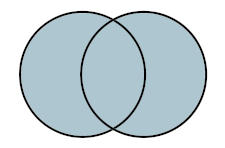
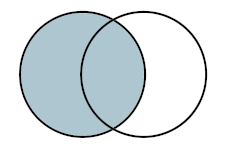
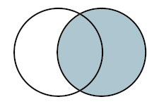
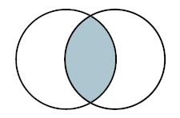

<font size="3">

[⇦ Back](../../R.html)

```{r, echo = FALSE}
options(width = 120)
```

Example Data
============
Here are the final log standings from the 2018-19 and 2019-20 English Premier League seasons, sorted alphabetically by team:

```{r, results = "hold"}
EPL_2018_19 <- data.frame(
    "Team" = c(
        "Arsenal", "Bournemouth", "Brighton & Hove Albion", "Burnley", "Cardiff City", "Chelsea", "Crystal Palace",
        "Everton", "Fulham", "Huddersfield Town", "Leicester City", "Liverpool", "Manchester City", "Manchester United",
        "Newcastle United", "Southampton", "Tottenham Hotspur", "Watford", "West Ham United", "Wolverhampton Wanderers"
    ),
    "Points" = c(70, 45, 36, 40, 34, 72, 49, 54, 26, 16, 52, 97, 98, 66, 45, 39, 71, 50, 52, 57)
)
EPL_2019_20 <- data.frame(
    "Team" = c(
        "Arsenal", "Aston Villa", "Bournemouth", "Brighton & Hove Albion", "Burnley", "Chelsea", "Crystal Palace",
        "Everton", "Leicester City", "Liverpool", "Manchester City", "Manchester United", "Newcastle United",
        "Norwich City", "Sheffield United", "Southampton", "Tottenham Hotspur", "Watford", "West Ham United",
        "Wolverhampton Wanderers"
    ),
    "Points" = c(56, 35, 34, 41, 54, 66, 43, 49, 62, 99, 81, 66, 44, 21, 54, 52, 59, 34, 39, 59)
)

library(kableExtra)

kable_input <- kable(EPL_2018_19)
kable_styling(
    kable_input, bootstrap_options = c("striped", "scale_down", "condensed"), full_width = F, font_size = 11,
    position = "float_left"
)
kable_input <- kable(EPL_2019_20)
kable_styling(
    kable_input, bootstrap_options = c("striped", "scale_down", "condensed"), full_width = F, font_size = 11,
    position = "center"
)
```

Concatenation
=============
Concatenating two data frames is actually *not* the same as merging them, it's simply combining them by sticking one next to the other:

Append a data frame to the bottom of another with the `rbind()` (row bind) function:

```{r, results = "hold"}
total <- rbind(EPL_2018_19, EPL_2019_20)
print(total)
```

Append a data frame to the side of another with the `cbind()` (column bind) function:

```{r, results = "hold"}
total <- cbind(EPL_2018_19, EPL_2019_20)
print(total)
```

Merging
=======
There are four types of merging:

- Keep all rows in *both* data frames (don't delete any data)
- Keep all rows in the *left* data frame (but delete those in the right data frame that don't appear in the left)
- Keep all rows in the *right* data frame (but delete those in the left data frame that don't appear in the right)
- Don't keep all rows, only keep those that are common to both data frames

<center>
  <br>
 

*(1) Keep all rows in both data frames, (2) keep all rows in the left data frame but only those in the right that are also in the left, (3) keep all rows in the right data frame but only those in the left that are also in the right, (4) keep only the rows that appear in both data frames*
</center>

Keep all rows in both data frames
---------------------------------
Merge the data from both seasons by team name:

```{r, results = "hold"}
outer <- merge(EPL_2018_19, EPL_2019_20, by = "Team", all = TRUE)
print(outer)
```

As you can see, the teams that were in the league for both seasons (eg Arsenal and Bournemouth) have values in the "Points" columns for both seasons, whereas teams such as Aston Villa and Cardiff City which were promoted/relegated after the first season only have values for one season. For the other season there is an "NA" (not available). That is why there are 23 rows in the data frame when there are only 20 teams in the Premier League in any one season.

Keep all rows in the left data frame
------------------------------------
To see the points for all the teams in the 2018-19 season and the season after:

```{r, results = "hold"}
left <- merge(EPL_2018_19, EPL_2019_20, by = "Team", all.x = TRUE)
print(left)
```

The three teams that got promoted into the Premier League are not shown here as their names do not appear in the left data frame.

Keep all rows in the right data frame
-------------------------------------
To see the points for all the teams in the 2019-20 season and the season before:

```{r, results = "hold"}
right <- merge(EPL_2018_19, EPL_2019_20, by = "Team", all.y = TRUE)
print(right)
```

The three teams that got relegated from the Premier League are not shown here as their names do not appear in the right data frame.

Keep only the rows that appear in both data frames
--------------------------------------------------
To see the points for all the teams that were in the Premier League for both seasons:

```{r, results = "hold"}
inner <- merge(EPL_2018_19, EPL_2019_20, by = "Team")
print(inner)
```

The teams that got promoted and relegated from the Premier League are not shown here as their names do not appear in both data frames. As a results only 17 rows remain. **This is the default behaviour of the `merge()` function**.

Merge on Common Columns
=======================
In the previous four examples the two data frames only had one column in common - team name - and so that was the column we merged on. However, if we have data frames with two (or more) columns in common and we merge on just one of those columns we get duplication of the other(s):

```{r}
EPL_2020_21 <- data.frame(
    team = c(
        "Manchester City", "Manchester United", "Liverpool", "Chelsea", "Leicester City", "West Ham United",
        "Tottenham Hotspur", "Arsenal", "Leeds United", "Everton", "Aston Villa", "Newcastle United",
        "Wolverhampton Wanderers", "Crystal Palace", "Southampton", "Brighton & Hove Albion", "Burnley",
        "Fulham", "West Bromwich Albion", "Sheffield United"
    ),
    location = c(
        "Manchester", "Manchester", "Liverpool", "London", "Leicester", "London", "London", "London",
        "Leeds", "Liverpool", "Birmingham", "Newcastle upon Tyne", "Wolverhampton", "London", "Southampton",
        "Falmer", "Burnley", "London", "West Bromwich", "Sheffield"
    ),
    points_2020_21 = c(
        86, 74, 69, 67, 66, 65, 62, 61, 59, 59, 55, 45, 45, 44, 43, 41, 39, 28, 26, 23
    )
)

EPL_2021_22 <- data.frame(
    team = c(
        "Manchester City", "Liverpool", "Chelsea", "Tottenham Hotspur", "Arsenal", "Manchester United",
        "West Ham United", "Leicester City", "Brighton & Hove Albion", "Wolverhampton Wanderers",
        "Newcastle United", "Crystal Palace", "Brentford", "Aston Villa", "Southampton", "Everton",
        "Leeds United", "Burnley", "Watford", "Norwich City"
    ),
    location = c(
        "Manchester", "Liverpool", "London", "London", "London", "Manchester", "London", "Leicester", "Falmer",
        "Wolverhampton", "Newcastle upon Tyne", "London", "London", "Birmingham", "Southampton", "Liverpool",
        "Leeds", "Burnley", "Watford", "Norwich"
    ),
    points_2021_22 = c(
        93, 92, 74, 71, 69, 58, 56, 52, 51, 51, 49, 48, 46, 45, 40, 39, 38, 35, 23, 22
    )
)

df <- merge(EPL_2020_21, EPL_2021_22, by = "team", all = T)
print(df)
```

You can see what has gone wrong here: the 'location' information has effectively been duplicated and columns 'location.x' and 'location.y' have been created. To fix this we can merge on the common columns manually by listing them in a vector that gets given to the `by` keyword argument:

```{r}
df <- merge(EPL_2020_21, EPL_2021_22, by = c("team", "location"), all = T)
print(df)
```

...or, we can find these common columns automatically. To do this, use the `intersect()` function on the vectors of the column names of the two data frames to get the **intersection** of these two sets:

```{r}
print(intersect(colnames(EPL_2020_21), colnames(EPL_2021_22)))
```

The merging step can now look like this:

```{r}
df <- merge(EPL_2020_21, EPL_2021_22, by = intersect(colnames(EPL_2020_21), colnames(EPL_2021_22)), all = T)
print(df)
```

Note that this `intersect()` function only works as expected on vectors, not on the data frames themselves:

```{r}
print(intersect(EPL_2020_21, EPL_2021_22))
```

We didn't get anything useful from that!

[⇦ Back](../../R.html)

</font>
