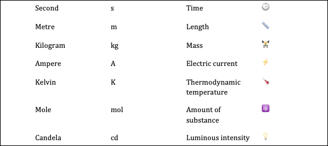
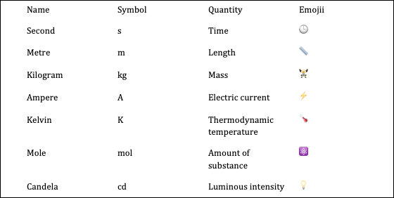
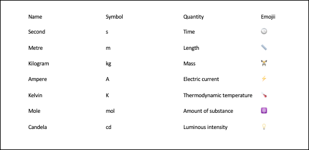
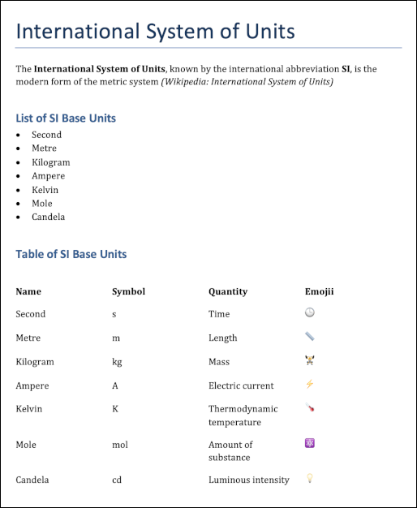

<font size="3">

[⇦ Back](../../python.html)

```{r, echo = FALSE}
options(width = 120)
```

This page looks at how to save a Pandas data frame as a table in a Word document from inside Python. Various other bits and pieces of formatting can also be done to the Word doc, and other Python objects like strings and numbers can be included to create full-blown reports. This can be extremely useful when you want to show the outcome of an analysis in Python to a non-technical audience.

The steps we need to follow are:

1. Import the required package(s)
2. Create the data frame
3. Initialise the Word document
4. Initialise the table that will go into the Word document
5. Add the information in the data frame into the table in the Word document
6. Export it to your computer
7. Customise the format of the table
8. Add content to the document

Import the Required Package(s)
==============================
In order to do the exporting, the **docx** package is needed. Install this from
the terminal with `python3.9 -m pip install docx` (replace `python3.9` with
the version you have) then create a new Python script where you start by
importing it:

```{python}
import docx
```

Next, import the **pandas** package (install it with `python3.9 -m pip install pandas`) which will allow you to create data frames:

```{python}
import pandas as pd
```

Create the Data Frame
=====================
This is the information you will eventually add as a table to a Word document. For this tutorial, we'll use information about the SI units as an example:

```{python}
# Create a data frame
si_units = {
    'Name': ['Second', 'Metre', 'Kilogram', 'Ampere', 'Kelvin', 'Mole', 'Candela'],
    'Symbol': ['s', 'm', 'kg', 'A', 'K', 'mol', 'cd'],
    'Quantity': [
        'Time', 'Length', 'Mass', 'Electric current', 'Thermodynamic temperature',
        'Amount of substance', 'Luminous intensity'
    ],
    'Emojii': ['🕒', '📏', '🏋️', '⚡', '🌡️', '⚛️', '💡']
}
df = pd.DataFrame(si_units)
print(df)
```

Initialise the Word Document
============================
With the docx package imported we can now create an empty Word document object (which we will call `doc`) by using the `Document()` function:

```{python}
# Initialise the Word document
doc = docx.Document()
```

Initialise the Table
====================
Create an empty table object and add it to the document with the `add_table()` function. When doing this, you need to tell the function how many rows and columns your future table will have; use the shape of the data frame to get this info:

```{python}
# Initialise the table
t = doc.add_table(rows=df.shape[0], cols=df.shape[1])
```

Add the Data Frame into the Table
=================================
This can be done most easily by iterating over every cell in the data frame and adding the contents of each to the corresponding cell in the table:

```{python}
# Add the body of the data frame to the table
for i in range(df.shape[0]):
    for j in range(df.shape[1]):
        cell = df.iat[i, j]
        t.cell(i, j).text = str(cell)
```

Export
======

```{python}
# Save the Word doc
doc.save('table 1.docx')
```

Your Word document will look like this:



Customise the Format
====================

Add Column Headings
-------------------
You'll notice that the above table doesn't include column headings. To have these, the table needs to be created with an extra row at the top which gets filled with the series' names from the data frame:

```{python}
# Initialise the Word document
doc = docx.Document()
# Initialise the table
t = doc.add_table(rows=(df.shape[0] + 1), cols=df.shape[1])
# Add the column headings
for j in range(df.shape[1]):
    t.cell(0, j).text = df.columns[j]
# Add the body of the data frame
for i in range(df.shape[0]):
    for j in range(df.shape[1]):
        cell = df.iat[i, j]
        t.cell(i + 1, j).text = str(cell)
# Save the Word doc
doc.save('table 2.docx')
```



Note that you don't have to initialise the table with the exact number of rows; you can create it with 1 row and add new ones as you go via the `.add_row()` method:

```{python}
# Initialise the Word document
doc = docx.Document()
# Initialise the table
t = doc.add_table(rows=1, cols=df.shape[1])
# Add the column headings
for j in range(df.shape[1]):
    t.cell(0, j).text = df.columns[j]
# Add the body of the data frame
for i in range(df.shape[0]):
    row = t.add_row()
    for j in range(df.shape[1]):
        cell = df.iat[i, j]
        row.cells[j].text = str(cell)
```

This is useful if you don't know at the start how many rows your table will end up needing.

Edit the Font
-------------
The docx package has a sub-module called **Pt** which can be used for this:

```{python}
from docx.shared import Pt

# Settings
style = doc.styles['Normal']
font = style.font
font.name = 'Calibri'
font.size = Pt(8)

# Save the Word doc
doc.save('table 3.docx')
```



Borders
-------
Add in cell borders by setting the table 'style' to "TableGrid":

```{python, eval = FALSE}
# Initialise the Word document
doc = docx.Document()
# Initialise the table
t = doc.add_table(rows=1, cols=df.shape[1])
# Add borders
t.style = 'TableGrid'
# Add the column headings
for j in range(df.shape[1]):
    t.cell(0, j).text = df.columns[j]
# Add the body of the data frame
for i in range(df.shape[0]):
    row = t.add_row()
    for j in range(df.shape[1]):
        cell = df.iat[i, j]
        row.cells[j].text = str(cell)
# Save the Word doc
doc.save('table 4.docx')
```

```{python, results='hide', echo=FALSE}
# Initialise the Word document
doc = docx.Document()
# Initialise the table
t = doc.add_table(rows=1, cols=df.shape[1])
# Add borders
t.style = 'TableGrid'
# Add the column headings
for j in range(df.shape[1]):
    t.cell(0, j).text = df.columns[j]
# Add the body of the data frame
for i in range(df.shape[0]):
    row = t.add_row()
    for j in range(df.shape[1]):
        cell = df.iat[i, j]
        row.cells[j].text = str(cell)
# Save the Word doc
doc.save('table 4.docx')
```


Add Page Text (Paragraphs and Headings)
=======================================

- Use `.add_heading(str, level)` to add a heading where `str` is the text of the heading and `level` is the hierarchical level ("0" is a main heading, "1" is a sub-heading, "2" is a sub-sub-heading, etc)
- Use `.add_paragraph(str)` to have `str` become a paragraph of text
    - Create a paragraph *object* by assigning it to a variable, eg `p = doc.add_paragraph(str)` where `p` is now an object that represents the paragraph of text
    - This gives you the option of augmenting the paragraph, eg you can use `p.add_run(str)` to add a run of text onto the end of it
    - Using `p.add_run(str).bold = True` and `p.add_run(str).italic = True` will add **bold** and *italic* text
    - The keyword argument `style` can be used to edit the text format further, eg by creating a list via `style='List Bullet'`
- `.add_paragraph(str)` also works on table cells, which means that our column headings can be made bold:

```{python, eval = FALSE}
# Initialise the Word document
doc = docx.Document()

doc.add_heading('International System of Units', 0)

p = doc.add_paragraph('The ')
p.add_run('International System of Units').bold = True
p.add_run(', known by the international abbreviation ')
p.add_run('SI').bold = True
p.add_run(', is the modern form of the metric system ')
p.add_run('(Wikipedia: International System of Units)').italic = True

doc.add_heading('List of SI Base Units', level=1)

doc.add_paragraph('Second', style='List Bullet')
doc.add_paragraph('Metre', style='List Bullet')
doc.add_paragraph('Kilogram', style='List Bullet')
doc.add_paragraph('Ampere', style='List Bullet')
doc.add_paragraph('Kelvin', style='List Bullet')
doc.add_paragraph('Mole', style='List Bullet')
doc.add_paragraph('Candela', style='List Bullet')

doc.add_heading('Table of SI Base Units', level=1)

# Initialise the table
t = doc.add_table(rows=1, cols=df.shape[1])
# Add the column headings
for j in range(df.shape[1]):
    cell = df.columns[j]
    p = t.cell(0, j).add_paragraph('')
    p.add_run(str(cell)).bold = True
# Add the body of the data frame
for i in range(df.shape[0]):
    row = t.add_row()
    for j in range(df.shape[1]):
        cell = df.iat[i, j]
        row.cells[j].text = str(cell)

# Save the Word doc
doc.save('table 5.docx')
```

```{python, results='hide', echo=FALSE}
# Initialise the Word document
doc = docx.Document()

doc.add_heading('International System of Units', 0)

p = doc.add_paragraph('The ')
p.add_run('International System of Units').bold = True
p.add_run(', known by the international abbreviation ')
p.add_run('SI').bold = True
p.add_run(', is the modern form of the metric system ')
p.add_run('(Wikipedia: International System of Units)').italic = True

doc.add_heading('List of SI Base Units', level=1)

doc.add_paragraph('Second', style='List Bullet')
doc.add_paragraph('Metre', style='List Bullet')
doc.add_paragraph('Kilogram', style='List Bullet')
doc.add_paragraph('Ampere', style='List Bullet')
doc.add_paragraph('Kelvin', style='List Bullet')
doc.add_paragraph('Mole', style='List Bullet')
doc.add_paragraph('Candela', style='List Bullet')

doc.add_heading('Table of SI Base Units', level=1)

# Initialise the table
t = doc.add_table(rows=1, cols=df.shape[1])
# Add the column headings
for j in range(df.shape[1]):
    cell = df.columns[j]
    p = t.cell(0, j).add_paragraph('')
    p.add_run(str(cell)).bold = True
# Add the body of the data frame
for i in range(df.shape[0]):
    row = t.add_row()
    for j in range(df.shape[1]):
        cell = df.iat[i, j]
        row.cells[j].text = str(cell)

# Save the Word doc
doc.save('table 5.docx')
```

...and here's the finished product:



[⇦ Back](../../python.html)

</font>
