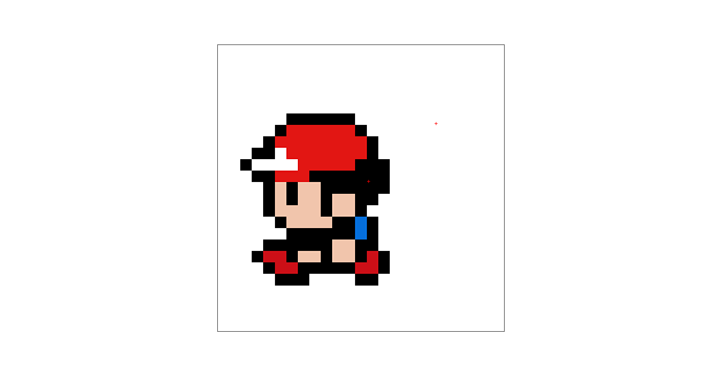

<font size="3">

[⇦ Back](../../python.html)

Python Packages
===============
The code on this page uses the Matplotlib and Pillow packages which can be
installed from the terminal via the following commands:

```bash
# "python3.12" should correspond to the version of Python you are using
python3.12 -m pip install matplotlib
python3.12 -m pip install pillow
```

Once finished, import these packages into your Python script along with the
built-in `platform` and `json` modules:

```{python}
# Matplotlib is for creating static, animated and interactive visualizations
from matplotlib import pyplot as plt
# Pillow is a fork of the Python Imaging Library (PIL) for image processing
from PIL import Image
# Access to underlying platform's identifying data
import platform
# JSON encoder and decoder
import json
```

Later on in this tutorial we will be creating interactive plots. If you get the
following error while trying to do that it means that the backend being used
for displaying the image is not set up for interactive mode:

```
"UserWarning: FigureCanvasAgg is non-interactive, and thus cannot be shown"
```

Try using a different backend, for example 'Qt5Agg' or 'TkAgg'. As of
2024-01-31, 'Qt5Agg' works on Ubuntu 22.04 and can be installed from the
terminal with:

```bash
python3 -m pip install PyQt5
python3 -m pip install PySide2
```

Then, you can switch to it from within your Python script:

```python
# Use a backend that supports interactive mode
plt.switch_backend('Qt5Agg')
```

As of 2024-01-31, Tkinter has been released for Python 3.11 but not for
Python 3.12 on Ubuntu 22.04. As a result, the 'TkAgg' backend will work in 3.11
but not in 3.12. You can install Tkinter from the terminal via the following

```bash
sudo apt-get install python3-tk
# or
sudo apt-get install python3.11-tk
# but not `sudo apt-get install python3.12-tk`
```

Once installed, you can switch to TkAgg:

```python
plt.switch_backend('TkAgg')
```

Import an Image
===============
For our tutorial, we'll use an image of Red from the Generation I Pokémon
games:


If this image file is in the same folder as your Python script you can import
it like this:

```{python, echo = FALSE}
import os

# Set the QT_QPA_PLATFORM environment variable to wayland
os.environ['QT_QPA_PLATFORM'] = 'wayland'
# Set the Matplotlib backend to one that is compatible with Wayland
plt.switch_backend('Agg')
```

```{python, eval = FALSE}
# Import image
img = Image.open('red-225x225.png')
# Display image
plt.imshow(img, cmap='gray')
plt.xticks([])
plt.yticks([])
```

In order to get the best view, maximise the window that's showing your image:

```{python, eval = FALSE}
# Maximise the window
manager = plt.get_current_fig_manager()
if plt.get_backend() == 'TkAgg':
    if platform.system() == 'Linux':
        manager.resize(*manager.window.maxsize())
    elif platform.system() == 'Windows':
        manager.window.state('zoomed')
elif plt.get_backend() == 'Qt5Agg':
    if platform.system() == 'Linux':
        manager.window.showMaximized()
else:
    print('ERROR: different Matplotlib backend detected!')
```

Our image is static at this point; if we were to click on it nothing would
happen. We need to enable plot interaction by using `plt.ion()` which will mean
that **i**nteractive mode is **on** (`plt.ioff()` would turn it off):

```{python, eval = FALSE}
plt.ion()
```

Finally, show the image:

```{python, eval = FALSE}
plt.show()
```

```{python, echo = FALSE, results = 'hide'}
# Import image
img = Image.open('red-225x225.png')
# Display image
plt.imshow(img, cmap='gray')
plt.xticks([])
plt.yticks([])
```

Click on Image
==============
What we want to do now is be able to click on the image and record the x- and
y-coordinates of the clicks. Let's initialise a list to store that information
and use `plt.ginput()` to prompt the user for two clicks worth of
**g**raphical **input**:

```{python, eval = FALSE}
# Click and get click locations
click_locations = []
number = 2
if number == 1:
    print(f'Click on the graph once')
else:
    print(f'Click on the graph {number} times')
click_locations.extend(plt.ginput(number))
```

```
## Click on the graph 2 times
```

Save the list of the click locations to an external text file:

```{python, eval = FALSE}
filename = 'Click Locations.txt'
with open(filename, 'w') as file:
    json.dump(click_locations, file)
```

Display the Click Locations
===========================
Plot the image and the click locations on top of the existing image:

```{python, eval = FALSE}
plt.imshow(img)
plt.xticks([])
plt.yticks([])
print('Click locations:')
for click_location in click_locations:
    print(click_location)
    plt.plot(click_location[0], click_location[1], 'r+')

# Maximise window
manager = plt.get_current_fig_manager()
if plt.get_backend() == 'TkAgg':
    manager = plt.get_current_fig_manager()
    if platform.system() == 'Linux':
        manager.resize(*manager.window.maxsize())
    elif platform.system() == 'Windows':
        manager.window.state('zoomed')
elif plt.get_backend() == 'Qt5Agg':
    if platform.system() == 'Linux':
        manager.window.showMaximized()
else:
    print('ERROR: different matplotlib backend detected!')

# Disable plot interaction
plt.ioff()
# Show image
plt.show()
```

```
## Click locations:
## (117.95930425766653, 106.80037618471599)
## (170.8976657937763, 61.339184357096315)
```



The two places where I clicked on the image are shown as red crosses.

*This tutorial is followed by [this one](pixel_analysis.html) on how to analyse
pixel values*

[⇦ Back](../../python.html)

</font>
