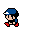
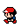
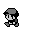
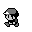
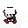

<font size="3">

[⇦ Back](../../python.html)

Python Packages
===============
The code on this page uses the Pillow package which can be installed from the terminal via the following:

```bash
# "python3.12" should correspond to the version of Python you are using
python3.12 -m pip install pillow
```

Once finished, import this package into your Python script as follows:

```{python}
# Pillow is a fork of the Python Imaging Library (PIL) for image processing
from PIL import Image, ImageDraw
```

Note that the Pillow package gets referred to as `PIL` in scripts. This is to preserve backwards compatibility with an older package called PIL (the Python Imaging Library).

Import Images
=============
We will use two images of Red from Generation I of Pokémon for this tutorial, one with a red hat and one with a blue one. The red hat version will serve as our 'expected' image (ie the correct one) while the blue hat version will be our 'actual' image that we need to test to see if it meets our expectations of what Red should look like:

```{python}
actual = Image.open('blue-32x32.png')
expected = Image.open('red-32x32.png')
```

 &nbsp; 

These images are both 32x32 pixels in size so they look very blurry when displayed above. The small size does, however, make them easier to work with because we know exactly how many pixels are different in each image!

Compare Images
==============
Construct a function to do the actual pixel-by-pixel analysis:

```{python}
def compare_images(im1, im2, tolerance=0.002):
    """
    Compare two images.

    If tolerance is defined the outcome will compared with the accepted
    tolerance. The tolerance is a percentage difference calculated using
    https://rosettacode.org/wiki/Percentage_difference_between_images#Python
    """
    # Remove alpha layer if it exists
    if im1.getbands() == ('R', 'G', 'B', 'A'):
        im1 = im1.convert('RGB')
    if im2.getbands() == ('R', 'G', 'B', 'A'):
        im2 = im2.convert('RGB')
    if im1.getbands() == ('L', 'A'):
        im1 = im1.convert('L')
    if im2.getbands() == ('L', 'A'):
        im2 = im2.convert('L')

    # Check that the images can be compared
    if im1.mode != im2.mode:
        raise Exception(f'Different kinds of images: {im1.mode} != {im2.mode}')
    if im1.size != im2.size:
        raise Exception(f'Different sizes of images: {im1.size} != {im2.size}')

    # Pixel-by-pixel comparison
    pairs = zip(im1.getdata(), im2.getdata())
    # If the image is greyscale
    if len(im1.getbands()) == 1:
        # Total difference
        diff = sum(abs(pixel1 - pixel2) for pixel1, pixel2 in pairs)
    # If the image is RGB
    else:
        # Total difference
        diff = sum(abs(c1 - c2) for p1, p2 in pairs for c1, c2 in zip(p1, p2))

    # Total number of colour components
    N = im1.size[0] * im1.size[1] * len(im1.getbands())

    # Calculate the percentage difference
    percentage_diff = diff / 255 / N * 100

    # Assess if the difference falls within the tolerance
    if percentage_diff <= tolerance:
        images_are_same = True
    else:
        images_are_same = False

    return percentage_diff, images_are_same, tolerance
```

Let's try it out:

```{python}
percentage_diff, images_are_same, tolerance = compare_images(actual, expected)
```

Did the two images pass the comparison test?

```{python}
if images_are_same:
    results = f"""The comparison is successful. The actual difference of
{percentage_diff:05.3f}% falls under the tolerance of {tolerance:05.3f}%."""
else:
    results = f"""The comparison failed. The actual difference of
{percentage_diff:05.3f}% exceeds the tolerance of {tolerance:05.3f}%."""

print(results)
```

This is expected: the images are not the same so the comparison failed!

Testing
=======
Even though the previous example gave an expected result this does not automatically imply that our code works! Let's do some testing by using images that will give us predictable results:

Reversing the Order
-------------------
```{python}
actual = Image.open('red-32x32.png')
expected = Image.open('blue-32x32.png')

percentage_diff, images_are_same, tolerance = compare_images(actual, expected)

print(f'{percentage_diff:05.3f}%')
```

The difference of 2.213% matches what we got the first time, so this is expected.

Duplicate Images
----------------
Next, if we compare an image to itself we should find that it's a perfect match:

```{python}
actual = Image.open('red-32x32.png')
expected = Image.open('red-32x32.png')

percentage_diff, images_are_same, tolerance = compare_images(actual, expected)

if images_are_same:
    results = f"""The comparison is successful. The actual difference of
{percentage_diff:05.3f}% falls under the tolerance of {tolerance:05.3f}%."""
else:
    results = f"""The comparison failed. The actual difference of
{percentage_diff:05.3f}% exceeds the tolerance of {tolerance:05.3f}%."""

print(results)
```

This is, again, working as expected.

Greyscale Images
----------------
Now let's compare two greyscale images:

```{python}
actual = Image.open('black-32x32-greyscale.png')
expected = Image.open('white-32x32-greyscale.png')
```

 &nbsp; 

The difference between the two images is that 7 pixels have been changed from white to black in the peak of Red's cap. Given that the images are 32×32 pixels in size this means that the percentage difference between them should be the proportion of the image that has changed:

$$ \dfrac{7}{32 \times 32} \times 100 = 0.684...% $$

Let's see if that's indeed what we get:

```{python}
percentage_diff, images_are_same, tolerance = compare_images(actual, expected)

print(percentage_diff)
```

Which is the expected value of 0.684% when rounded off.

### A Note on Modes and Bands
We need to be careful that we use decomposed (single-component) greyscale images, not just RGB images that are grey! Each pixel in a **greyscale** image will have a *single* colour value whereas each pixel in an **RGB** image will have *three* colour values (although in an RGB image which is grey these three will all be the same). Check the mode of your image with the `.mode` attribute:

```{python}
print(actual.mode, expected.mode)
```

'LA' means that the images have 'luminosity' (brightness) and 'alpha' (transparency) channels only - no colour. An image's mode can be 'RGB', 'L', 'RGBA' or 'LA' depending on whether it is RGB or greyscale and if it has transparency or not. This can also be checked with the `.getbands()` method:

```{python}
print(actual.getbands(), expected.getbands())
```

This contains the same information but in arrays.

### Converting to Greyscale
The `.convert('L')` method will convert an image to greyscale and 'flatten' it. This means that instead of having three or four components - 'R', 'G', 'B' and/or 'A' -  it will just have one: 'L'. This can have implications on how many pixels in one image are the same as in another image and hence the output of our `compare_images()` function, so it's best to check that they are the same mode.

Colour Images
-------------
Ok. Our code works for identical images and greyscale images, but how can we confirm that our first example worked when it had two, different, colour RGB images? Let's examine the formula for the percentage difference between images:

$$ \left( \sum \left| c_2 - c_1 \right| \div 255 \times 100 \right) \div N $$

where $c_1$, $c_2$ are colour components (a red, a green or a blue value) from two pixels and $N$ is the total number of colour components in the image. For RGB images, $N$ will be the total number of pixels times three whereas for greyscale images it will be the total number of pixels times one.

In our colour pictures of Red there are 1024 pixels because the images are
32×32 in size. Each of these 1024 pixels has three component colours values
so, for these images:

$$ N = 1024 * 3 = 3072 $$

A total of 44 pixels are different between them: there are 44 colour pixels
in Red's hat which are red in one image and blue in the other. The red pixels
have $RGB = (226, 22, 19)$ while the blue ones have $RGB = (3, 71, 141)$ which
is a total difference per pixel of:

$$ \left| 3 - 226 \right| + \left| 71 - 22 \right| + \left| 141 - 19 \right| = 394 $$

So the total difference is:

$$ 394 \times 44 = 17,336 $$

Continuing with the formula given above:

$$ \left( 17,336 \div 255 \times 100 \right) \div 3072 = 2.213\% $$

Which is what we got when we ran the code above but, just to confirm, here it is again:

```{python}
actual = Image.open('blue-32x32.png')
expected = Image.open('red-32x32.png')

percentage_diff, images_are_same, tolerance = compare_images(actual, expected)

print(f'{percentage_diff:05.3f}%')
```

Using SciPy
===========
An alternative method is to calculate the **Manhattan norm** and the **Zero norm** of the differences between the images.

The Manhattan norm (also known as the L1 norm) of a vector is the sum of the
absolute values of its components. The Zero norm of a vector is simply the
count of non-zero elements in the vector. In the context of comparing two
images, you can treat the pixel values as vectors. The Manhattan norm gives you
a measure of the total absolute difference between pixel values while the
Zero norm gives you the count of differing pixels.

```{python}
import imageio.v3 as imageio
from scipy.linalg import norm
import numpy as np

actual = 'blue-32x32.png'
expected = 'red-32x32.png'
image1 = imageio.imread(actual, pilmode='RGB')  # Use RGB, not RGBA
image2 = imageio.imread(expected, pilmode='RGB')  # Use RGB, not RGBA

# Calculate the element-wise difference between the images
diff = image1 - image2

# Calculate the Manhattan norm (L1 norm)
m_norm = np.sum(abs(diff))
print('Manhattan norm:', m_norm, 'or', m_norm / image1.size, 'per pixel')
```

There are 44 pixels that are different, so the Zero norm is:

$$ 44 \times 3 = 132 $$

```{python}
# Calculate the Zero norm
z_norm = int(norm(diff.ravel(), 0))
print('Zero norm:', z_norm, 'or', z_norm / image1.size, 'per pixel')
```

Equivalent Calculations
-----------------------
Another way of calculating the same things is as follows:

```{python}
# Flatten the images to 1D arrays
flat_image1 = image1.flatten()
flat_image2 = image2.flatten()

# Calculate the Manhattan norm (L1 norm)
manhattan_norm = norm(flat_image1 - flat_image2, ord=1)
print(f'Manhattan norm (L1 norm): {manhattan_norm}')

# Calculate the Zero norm
zero_norm = np.count_nonzero(flat_image1 - flat_image2)
print(f'Zero norm: {zero_norm}')
```

Greyscale
---------
Sometimes it's easier to convert the array to greyscale first. Here's a
function that will do that:

```{python}
def to_greyscale(arr):
    """
    Convert to greyscale.

    If arr is a color image (a 3D array), convert it to greyscale (a 2D array).
    """
    if len(arr.shape) == 3:
        # Average over the last axis (color channels)
        return np.average(arr, -1)
    else:
        return arr
```

Exclude Areas
=============
Sometimes we only want to compare a subset of two images. In order do that, we
essentially need to crop out some of the images:

```{python}
def crop_out_areas(img, name, excluded_areas):
    """Exclude areas from the images for comparison."""
    draw = ImageDraw.Draw(img)
    if excluded_areas:
        for area in excluded_areas:
            left = area['left']
            top = area['top']
            width = area['width']
            height = area['height']
            xy = [(left, top), (left + width, top + height)]
            draw.rectangle(xy, fill=(127, 127, 127, 0))
    img.save(name[:-4] + '-cropped.png', 'png')

    return img
```

Let's test this out by first comparing the images normally:

```{python}
actual = Image.open('blue-32x32.png')
expected = Image.open('red-32x32.png')
percentage_diff, images_are_same, tolerance = compare_images(actual, expected)

print(percentage_diff)
```

...and then comparing them with some areas excluded:

```{python}
excluded_areas = [
    {'left': 1, 'top': 1, 'width': 3, 'height': 3},
    {'left': 6, 'top': 9, 'width': 10, 'height': 6}
]
# Crop out excluded areas
actual = crop_out_areas(actual, 'blue-32x32.png', excluded_areas)
expected = crop_out_areas(expected, 'red-32x32.png', excluded_areas)
percentage_diff, images_are_same, tolerance = compare_images(actual, expected)

print(percentage_diff)
```

The amount of difference has dropped to 0%! Let's take a look at the cropped images:

 &nbsp; 

Once we've cropped out the hats, the images become identical!

[⇦ Back](../../python.html)

</font>
