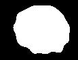
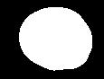

<font size="3">

[⇦ Back](../../python.html)

The [Sørensen–Dice coefficient](https://en.wikipedia.org/wiki/S%C3%B8rensen%E2%80%93Dice_coefficient) (aka the Dice similarity coefficient - DSC) is a measure of the similarity of two segmented images:

$$ DSC = 2 \times \dfrac{|X ∩ Y|}{|X| + |Y|} $$

Where $X$ are the pixels in image $x$ that have been identified in the segmentation and $Y$ are the equivalent pixels in image $y$.

The numerator represents the pixels that have been assigned into a segmentation in *both* images while the denominator represents the pixels that have been assigned into a segmentation in image $x$ *plus* the pixels assigned into a segmentation in image $y$.

Python Packages
===============
The code on this page uses the Numpy and Matplotlib packages which can be installed from the terminal via the following:

```bash
# "python3.12" should correspond to the version of Python you are using
python3.12 -m pip install numpy
python3.12 -m pip install matplotlib
```

Once finished, import these packages into your Python script as follows:

```{python}
# NumPy is the fundamental package for scientific computing with Python
import numpy as np
# Matplotlib is for creating static, animated and interactive visualizations
from matplotlib import pyplot as plt
```

Note that the Pillow package gets referred to as `PIL` in scripts. This is to preserve backwards compatibility with an older package called PIL (the Python Imaging Library).

If you're on an Ubuntu machine or similar it's possible that you will need to change some environment variables to be compatible with the Wayland system:

```{python}
# os provides a portable way of using operating system dependent functionality
import os

# Set the QT_QPA_PLATFORM environment variable to wayland
os.environ['QT_QPA_PLATFORM'] = 'wayland'
# Set the Matplotlib backend to one that is compatible with Wayland
plt.switch_backend('Agg')
```

Import Images
=============
We'll start with two images of a roundish feature, one being the original image posterised into two colours (black and white) and the second being the same image with a filter applied (a 9x9 smoothing filter) before the posterising:

```{python}
# Open first image
original = plt.imread('original.jpg')
# Select all of the image's x-axis and y-axis
original = original[:, :]

# Open second image
filtered = plt.imread('smooth9.jpg')
# Select all of the images' x-axis and y-axis
filtered = filtered[:, :]
```

 &nbsp; 

Count Overlapping Pixels
========================
With the two images being represented by two arrays of numbers we can iterate over the 'pixels' (the numbers in the arrays) and count how many are white and how many are black. Then, the number of overlapping pixels (those in *both* images that are white) can be counted and the Dice similarity coefficient calculated:

```{python}
def compute_mutual_overlap(img0, img1):
    """
    Compute the mutual overlap between two images.

    Parameters
    ----------
    img0, img1 : numpy.ndarray
        2D arrays of values representing (greyscale) pixel colour values.

    Returns
    -------
    dsc : float
        The Sørensen–Dice coefficient.
    overlap_percentage : float
        The percentage of white pixels in image 0 that are overlapped by white
        pixels in image 1.
    """
    # Initialise list of white pixels that overlap
    overlap = []
    # Initialise list of all white pixels in img0
    white_space_img0 = []
    # Initialise list of all white pixels in img1
    white_space_img1 = []
    # Get the shape of the images
    height, width = np.shape(img0)
    # Iterate over the rows of pixels in the images
    for row in range(height):
        # For each column of pixels in the images
        for column in range(width):
            # If the pixel in image 0 is sufficiently close to the
            # corresponding pixel in image 1 AND they are white
            if (
                img0[row, column] - 50 <= img1[row, column] <=
                img0[row, column] + 50
            ) and (156 <= img0[row,column] <= 256):
                # Add 1 to the list of overlapping pixels
                overlap.append(1)
            # If the pixel in image 0 is white
            if 156 <= img0[row, column] <= 256:
                # Add 1 to our list of white pixels in image 0
                white_space_img0.append(1)
            # If the pixel in image 1 is white
            if 156 <= img1[row, column] <= 256:
                # Add 1 to our list of white pixels in image 1
                white_space_img1.append(1)

    # Calculate percentage of white pixels in image 0 that are overlapped by
    # white pixels in image 1
    overlap_percentage = len(overlap) / len(white_space_img0) * 100

    # Calculate Dice similarity coefficient (DSC): 2 * overlap / whitespace
    dsc = (
        (2 * len(overlap)) / (len(white_space_img0) +
            len(white_space_img1))
    )

    return dsc, overlap_percentage


dsc, overlap_percentage = compute_mutual_overlap(original, filtered)
```

Print the results:

```{python}
results = f"""{overlap_percentage:.3f}% of the white pixels
in image 0 are overlapped by\nwhite pixels in image 1. The
Dice coefficient is {dsc:.3f}."""
print(results)
```

Repeat With New Images
======================
As we have written the code in a function it becomes a simple matter to import new images and calculate the DSC for each.

A 15x15 Smoothed Image
----------------------
```{python}
# Open image
filtered = plt.imread('smooth15.jpg')
filtered = filtered[:, :]
```


```{python}
# Calculate Dice coefficient
dsc, overlap_percentage = compute_mutual_overlap(original, filtered)

# Print results
results = f"""{overlap_percentage:.3f}% of the white pixels
in image 0 are overlapped by\nwhite pixels in image 1. The
Dice coefficient is {dsc:.3f}."""
print(results)
```

A 21x21 Smoothed Image
----------------------
```{python}
# Open image
filtered = plt.imread('smooth21.jpg')
filtered = filtered[:, :]
```



```{python}
# Calculate Dice coefficient
dsc, overlap_percentage = compute_mutual_overlap(original, filtered)

# Print results
results = f"""{overlap_percentage:.3f}% of the white pixels
in image 0 are overlapped by\nwhite pixels in image 1. The
Dice coefficient is {dsc:.3f}."""
print(results)
```

[⇦ Back](../../python.html)

</font>
