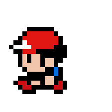

<font size="3">

[⇦ Back](../../python.html)

This tutorial follows on from [this one](click_to_interact.html) about how to interact with an image and save your click locations.

Python Packages
===============
The code on this page uses the Matplotlib, Pillow and NumPy packages which can
be installed from the terminal via the following commands:

```bash
# "python3.12" should correspond to the version of Python you are using
python3.12 -m pip install matplotlib
python3.12 -m pip install pillow
python3.12 -m pip install numpy
```

Once finished, import these packages into your Python script along with the
built-in `platform`, `json` and `pathlib` modules:

```{python}
# Matplotlib is for creating static, animated and interactive visualizations
from matplotlib import pyplot as plt
# Pillow is a fork of the Python Imaging Library (PIL) for image processing
from PIL import Image
# NumPy is the fundamental package for scientific computing with Python
import numpy as np

# Access to underlying platform's identifying data
import platform
# JSON encoder and decoder
import json
# Object-oriented filesystem paths
from pathlib import Path
```

Later on in this tutorial we will be creating interactive plots. If you get the
following error while trying to do that it means that the backend being used
for displaying the image is not set up for interactive mode:

```
"UserWarning: FigureCanvasAgg is non-interactive, and thus cannot be shown"
```

Try using a different backend, for example 'Qt5Agg' or 'TkAgg'. As of
2024-01-31, 'Qt5Agg' works on Ubuntu 22.04 and can be installed from the
terminal with:

```bash
python3 -m pip install PyQt5
python3 -m pip install PySide2
```

Then, you can switch to it from within your Python script:

```python
# Use a backend that supports interactive mode
plt.switch_backend('Qt5Agg')
```

As of 2024-01-31, Tkinter has been released for Python 3.11 but not for
Python 3.12 on Ubuntu 22.04. As a result, the 'TkAgg' backend will work in 3.11
but not in 3.12. You can install Tkinter from the terminal via the following

```bash
sudo apt-get install python3-tk
# or
sudo apt-get install python3.11-tk
# but not `sudo apt-get install python3.12-tk`
```

Once installed, you can switch to TkAgg:

```python
plt.switch_backend('TkAgg')
```

Get Click Locations
===================
As described in the previous tutorial, we can import an image in interactive mode, click on it, get the click locations and display them. Wrapping that code up in a function looks something like this:

```python
def get_click_locations(img, number):
    # Show the image
    plt.figure()
    plt.imshow(img, cmap='gray')
    plt.xticks([])
    plt.yticks([])

    # Maximise the window
    manager = plt.get_current_fig_manager()
    if plt.get_backend() == 'TkAgg':
        manager = plt.get_current_fig_manager()
        if platform.system() == 'Linux':
            manager.resize(*manager.window.maxsize())
        elif platform.system() == 'Windows':
            manager.window.state('zoomed')
    elif plt.get_backend() == 'Qt5Agg':
        if platform.system() == 'Linux':
            manager.window.showMaximized()
    else:
        print('ERROR: different Matplotlib backend detected!')

    # Enable plot interaction
    # (ion = interactive on; ioff = interactive off)
    plt.ion()

    # Click and get click locations
    plt.show()
    click_locations = []
    if number == 1:
        print(f'Click on the graph once')
    else:
        print(f'Click on the graph {number} times')
    click_locations.extend(plt.ginput(number))
    plt.close()

    return click_locations
```

Let's run this function on a small (32x32 pixel) image of Red, the protagonist from Pokémon:



```python
img = Image.open('red-32x32.png')
click_locations = get_click_locations(img, 2)
for click_location in click_locations:
    print(click_location)
```

```
## Click locations:
## (2.820847013784576, 20.16266998099137)
## (23.19596831009318, 9.698620212949791)
```


Save the click locations (note that they get changed from a list of tuples to a list of lists when you do this):

```python
filename = 'Click Locations.txt'
with open(filename, 'w') as file:
    json.dump(click_locations, file)
```

Load the Click Locations
========================
If we have already run this script we will have click locations saved and so can load those. Otherwise, get the user to create them:

```python
if Path(filename).is_file():
    print('Click locations have already been saved. Loading them now...')
    # Load the click locations as a list of lists
    with open(filename, 'r') as file:
        click_locations = json.load(file)
else:
    # Click and get click locations
    click_locations = get_click_locations(img, 2)

# Plot the data
plt.figure()
plt.imshow(img)
plt.xticks([])
plt.yticks([])
print('Click locations:')
for click_location in click_locations:
    print(click_location)
    plt.plot(click_location[0], click_location[1], 'r+')

# Maximise window
manager = plt.get_current_fig_manager()
if plt.get_backend() == 'TkAgg':
    manager = plt.get_current_fig_manager()
    if platform.system() == 'Linux':
        manager.resize(*manager.window.maxsize())
    elif platform.system() == 'Windows':
        manager.window.state('zoomed')
elif plt.get_backend() == 'Qt5Agg':
    if platform.system() == 'Linux':
        manager.window.showMaximized()
else:
    print('ERROR: different matplotlib backend detected!')

# Disable plot interaction
# (ion = interactive on; ioff = interactive off)
plt.ioff()

plt.show()
```

```
## Click locations:
## (2.820847013784576, 20.16266998099137)
## (23.19596831009318, 9.698620212949791)
```

Convert Click Locations to Pixels
=================================
If we want to colour in the pixels that have been clicked we need to take the x- and y-locations of those clicks and convert them into row and column numbers.

```python
pixel_locations = []
for click_location in click_locations:
    pixel_location = [int(round(loc)) for loc in click_location]
    pixel_locations.append(pixel_location)

# Plot the data
plt.figure()
plt.xticks([])
plt.yticks([])
for click_location in click_locations:
    plt.plot(click_location[0], click_location[1], 'r+')
for pixel_location in pixel_locations:
    # Turn the pixels green
    img.putpixel(pixel_location, (0, 255, 0))
plt.imshow(img)
# Maximise window
manager = plt.get_current_fig_manager()
if plt.get_backend() == 'TkAgg':
    manager = plt.get_current_fig_manager()
    if platform.system() == 'Linux':
        manager.resize(*manager.window.maxsize())
    elif platform.system() == 'Windows':
        manager.window.state('zoomed')
elif plt.get_backend() == 'Qt5Agg':
    if platform.system() == 'Linux':
        manager.window.showMaximized()
else:
    print('ERROR: different matplotlib backend detected!')
# Show the image
plt.show()
```


Draw a Line
===========
Now let's find the line between the two clicked pixels and the pixels that lie on it:

```python
# Find the pixels that line on the line between two given click locations
# Coordinates to check
x_check = np.linspace(click_locations[0][0], click_locations[1][0], 1000)
y_check = np.linspace(click_locations[0][1], click_locations[1][1], 1000)
xy_check = [[x, y] for x, y in zip(x_check, y_check)]
# Round each coordinate being checked to integers row and column numbers
# and assess if it is new
pixels_on_line = []
for xy in xy_check:
    pixel = [int(round(xy[0])), int(round(xy[1]))]
    if len(pixels_on_line) == 0:
        pixels_on_line.append(pixel)
    else:
        if pixels_on_line[-1] != pixel:
            pixels_on_line.append(pixel)

# Plot the data
img_copy = img.copy()
plt.figure()
plt.xticks([])
plt.yticks([])
for click_location in click_locations:
    plt.plot(click_location[0], click_location[1], 'r+')
for pixel_on_line in pixels_on_line:
    # Turn the pixels blue
    img_copy.putpixel(pixel_on_line, (0, 0, 255))
for pixel_location in pixel_locations:
    # Turn the pixels green
    img_copy.putpixel(pixel_location, (0, 255, 0))
plt.imshow(img_copy)
# Maximise window
manager = plt.get_current_fig_manager()
if plt.get_backend() == 'TkAgg':
    manager = plt.get_current_fig_manager()
    if platform.system() == 'Linux':
        manager.resize(*manager.window.maxsize())
    elif platform.system() == 'Windows':
        manager.window.state('zoomed')
elif plt.get_backend() == 'Qt5Agg':
    if platform.system() == 'Linux':
        manager.window.showMaximized()
else:
    print('ERROR: different matplotlib backend detected!')
# Show the image
plt.show()
```


Get the Pixel Values
====================
Take a look at the values of the pixels that lie upon the line in the above image:

```python
# Get the colour of each pixel under the line
colours_under_line = []
for pixel_on_line in pixels_on_line:
    colour = img.getpixel(pixel_on_line)
    colours_under_line.append(colour)
    print(pixel_on_line, colour)
```

```
## [3, 20] (0, 255, 0, 255)
## [4, 20] (255, 255, 255, 255)
## [4, 19] (255, 255, 255, 255)
## [5, 19] (255, 255, 255, 255)
```

```python
# Confirm that the image is RGBA
print(img.mode)
```

```
## RGBA
```

```python
# Get the averages of the pixels' RGB values
averages = []
for colour in colours_under_line:
    average = np.mean([colour[0], colour[1], colour[2]])
    averages.append(average)
print(averages)
```

```
## [85.0, 255.0, 255.0, 255.0, 255.0, 0.0, 203.33333333333334, 203.33333333333334, 203.33333333333334, 203.33333333333334, 203.33333333333334, 203.33333333333334, 0.0, 0.0, 203.33333333333334, 0.0, 0.0, 0.0, 0.0, 0.0, 0.0, 0.0, 0.0, 255.0, 255.0, 255.0, 255.0, 255.0, 255.0, 85.0]
```

```python
# Plot the average colour
plt.plot(range(len(averages)), averages)
plt.show()
```


This shows us how the colours of the pixels change as we move along the line from one of the clicked pixels to the other. The graph starts and ends just below 100, which corresponds to the green pixels at the start and the end. When the graph is at 255 it means that the line is going over white pixels, when it's at 0 it's going over black pixels and when it's at 200 those are the skin-colour pixels.

[⇦ Back](../../python.html)

</font>
