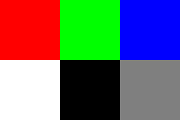

<font size="3">

[⇦ Back](../../python.html)

<!-- Created: 2023-12-25 -->
<!-- Based off code from: 2023-07-28 -->

Python Packages
===============
The code on this page uses the Matplotlib, Pillow and NumPy packages. These can be installed from the terminal with:

```bash
# Replace "python3.12" with the version of Python you are using
python3.12 -m pip install matplotlib
python3.12 -m pip install pillow
python3.12 -m pip install numpy
```

Once finished, import these packages into your Python script as follows:

```{python}
# Matplotlib is for creating static, animated and interactive visualizations
from matplotlib import pyplot as plt
# Pillow is a fork of the Python Imaging Library (PIL) for image processing
from PIL import Image
# NumPy is the fundamental package for scientific computing with Python
import numpy as np
```

If you're on an Ubuntu machine or similar it's possible that you will need to change some environment variables to be compatible with the Wayland system:

```{python}
import os

# Set the QT_QPA_PLATFORM environment variable to wayland
os.environ['QT_QPA_PLATFORM'] = 'wayland'
# Set the Matplotlib backend to one that is compatible with Wayland
plt.switch_backend('Agg')
```

Import Images
=============
Every image is made up of *pixels* and each pixel has a *colour*. Each colour is represented by three numbers - known as its **RGB** value - which represent the amount of **r**ed, **g**reen and **b**lue in that colour, respectively. An RGB value's three numbers range from 0 (least) to 1 (most):

- The colour "(1, 0, 0)" is pure red
- The colour "(0, 1, 0)" is pure green
- The colour "(0, 0, 1)" is pure blue
- The colour "(0, 0, 0)" is pure black (ie no colour)
- The colour "(1, 1, 1)" is pure white (ie all the colours)
- Any other combination of three numbers between 0 and 1 can be interpreted as a shade of colour: "(0.1, 0.6, 0.8)" is a greenish-blue, for example.

Note that, often, these three numbers will be represented as integers between 0 and 255 (ie "(255, 0, 0)" will be red, etc). This is just a different method of storing the same information.

Import Using Matplotlib
-----------------------
Let's take the following 3-pixel image as an example:


Let's see what happens when we import it into Python using `imread()` (**im**age **read**) from Matplotlib:

```{python}
# Read an image as a NumPy array
img = plt.imread('rgb.png')
# Print the pixels' values
print(img)
```

The first row of the above array is `[1. 0. 0.]` which corresponds to the fact that the first pixel is red. The second row is `[0. 1. 0.]` because the second pixel is green, and the third row is `[0. 0. 1.]` because the third pixel is blue. In fact, we actually have a **3-dimensional** array of numbers: the first dimension represents the *rows* of pixels, the second dimension is the *columns* and the third dimension is the *RGB values*. If we look up just the first row, first column and all the RGB values we get the following:

```{python}
# Print the first pixel's values
print(img[0, 0, :])
```

This tells us that the pixel in the first row and first column has the RGB value `[1. 0. 0.]` - ie it is red.

Import Using Pillow
-------------------
We can also read an image using the `open()` function from Pillow (previously known as PIL - the **P**ython **I**maging **L**ibrary - and it is still imported under the name `PIL`):

```{python}
# Open an image as a Pillow image
img = Image.open('rgb.png')
# Print the object
print(img)
```

This clearly hasn't given us an array but rather a PNG image object. Depending on what you are trying to do a PNG object might be easier to work with than an array.

Converting Between Arrays and PNG Objects
-----------------------------------------
A NumPy array can be converted into a PNG object using the `fromarray()` function from Pillow but be aware that the values need to be integers running from 0 to 255 as opposed to decimals between 0 and 1:

```{python}
# Read an image as a NumPy array
img = plt.imread('rgb.png')
# Scale the float32 array to the 0-255 range and convert to uint8
img = (img * 255).astype(np.uint8)
# Convert the NumPy array into a Pillow image
img = Image.fromarray(img)
# Print the object
print(img)
```

A PNG object can be converted into a NumPy array directly:

```{python}
# Open an image as a Pillow image
img = Image.open('rgb.png')
# Convert the Pillow image into a NumPy array
img = np.array(img)
# Print the pixels' values
print(img)
```

Note that the values in the array are on the 0-255 scale.

Display Images
==============
Display an image on a plot with `imshow()` (**im**age **show**) from Matplotlib:

```{python, eval = FALSE}
# Read an image as a NumPy array
img = plt.imread('rgb.png')
# Remove axes
plt.xticks([])
plt.yticks([])
# Show image
plt.imshow(img)
```

```{python, echo = FALSE, results = 'hide', out.width = "300px"}
# Read an image as a NumPy array
img = plt.imread('rgb.png')
# Remove axes
plt.xticks([])
plt.yticks([])
# Show image
plt.imshow(img)
```

...or directly with Pillow:

```{python, eval = FALSE}
# Open an image as a Pillow image
img = Image.open('rgb.png')
# Remove axes
plt.xticks([])
plt.yticks([])
# Show image
plt.imshow(img, cmap='gray')
```

```{python, echo = FALSE, results = 'hide', out.width = "300px"}
# Open an image as a Pillow image
img = Image.open('rgb.png')
# Remove axes
plt.xticks([])
plt.yticks([])
# Show image
plt.imshow(img, cmap='gray')
```

The `img.show()` method will also work but it will open the image in a new window as opposed to displaying it on this page.

Save Images
===========
Use `savefig()` to save an image being displayed with Matplotlib to your local machine:

```{python, eval = FALSE}
# Export
plt.savefig('rgb - saved.png')
```

The `.save()` method can be used with Pillow:

```{python, eval = FALSE}
# Export
img.save('rgb - saved.png')
```

Greyscale Images
================
To create a greyscale image, create an array that only contains 1s and 0s:

```{python, eval = FALSE}
# Create a greyscale image
img = np.array([
    [1, 0, 1],
    [1, 1, 1],
    [1, 0, 1],
])
# Remove axes
plt.xticks([])
plt.yticks([])
# Show image
plt.imshow(img, cmap='gray')
```

```{python, echo = FALSE, results = 'hide', out.width = "300px"}
# Create a greyscale image
img = np.array([
    [1, 0, 1],
    [1, 1, 1],
    [1, 0, 1],
])
# Remove axes
plt.xticks([])
plt.yticks([])
# Show image
plt.imshow(img, cmap='gray')
```

Convert a 2D Greyscale Image to 3D
----------------------------------

```{python, eval = FALSE}
# Convert a 'flat' image (an m*n array) into RGB (an m*n*3 array)
width, height = img.shape
rgb_image = np.zeros((width, height, 3))
rgb_image[:, :, 0] = img
rgb_image[:, :, 1] = img
rgb_image[:, :, 2] = img
# Remove axes
plt.xticks([])
plt.yticks([])
# Show image
plt.imshow(img, cmap='gray')
```

```{python, echo = FALSE, results = 'hide', out.width = "300px"}
# Convert a 'flat' image (an m*n array) into RGB (an m*n*3 array)
width, height = img.shape
rgb_image = np.zeros((width, height, 3))
rgb_image[:, :, 0] = img
rgb_image[:, :, 1] = img
rgb_image[:, :, 2] = img
# Remove axes
plt.xticks([])
plt.yticks([])
# Show image
plt.imshow(img, cmap='gray')
```

Convert a Colour Image to Greyscale
-----------------------------------
We'll use this larger image from now on:



To convert this colour image to greyscale it's easier if it's a PNG object, so import it as one. Once imported, use the `.convert()` method to convert it into `'L'` (**L**uminance) mode so that only the luminance (brightness) is stored:

```{python, eval = FALSE}
# Open an image as a Pillow image
img = Image.open('colours.png')
# Convert the image to greyscale
img = img.convert('L')
# Remove axes
plt.xticks([])
plt.yticks([])
# Show image
plt.imshow(img, cmap='gray')
```

```{python, echo = FALSE, results = 'hide', out.width = "300px"}
# Open an image as a Pillow image
img = Image.open('colours.png')
# Convert the image to greyscale
img = img.convert('L')
# Remove axes
plt.xticks([])
plt.yticks([])
# Show image
plt.imshow(img, cmap='gray')
```

Invert Colours
==============
To invert the colours, subtract their RGB values from 1:

```{python, eval = FALSE}
# Import
img = plt.imread('colours.png')
# Invert
img = 1 - img
# Remove axes
plt.xticks([])
plt.yticks([])
# Show image
plt.imshow(img, cmap='gray')
```

```{python, echo = FALSE, results = 'hide', out.width = "300px"}
# Import
img = plt.imread('colours.png')
# Invert
img = 1 - img
# Remove axes
plt.xticks([])
plt.yticks([])
# Show image
plt.imshow(img, cmap='gray')
```

Notice that the lower-right grey block didn't change colour - subtracting a grey value of 0.5 from 1 leaves you with 0.5 again!

Crop Images
===========
This can be done with array slicing on a NumPy array:

```{python, eval = FALSE}
# Import
img = Image.open('colours.png')
# Convert image to array
img = np.array(img)
# Crop
top, bottom, left, right = (0, 1, 0, 2)
img = img[top:bottom, left:right, :]
# Convert the array into an image
img = Image.fromarray(img)
# Remove axes
plt.xticks([])
plt.yticks([])
# Show image
plt.imshow(img, cmap='gray')
```

```{python, echo = FALSE, results = 'hide', out.width = "300px"}
# Import
img = Image.open('colours.png')
# Convert image to array
img = np.array(img)
# Crop
top, bottom, left, right = (0, 1, 0, 2)
img = img[top:bottom, left:right, :]
# Convert the array into an image
img = Image.fromarray(img)
# Remove axes
plt.xticks([])
plt.yticks([])
# Show image
plt.imshow(img, cmap='gray')
```

...or with the `.crop()` method on a PNG object:

```{python, eval = FALSE}
# Import
img = Image.open('colours.png')
# Crop
left, top, right, bottom = (0, 0, 2, 1)
img = img.crop((left, top, right, bottom))
# Remove axes
plt.xticks([])
plt.yticks([])
# Show image
plt.imshow(img, cmap='gray')
```

```{python, echo = FALSE, results = 'hide', out.width = "300px"}
# Import
img = Image.open('colours.png')
# Crop
left, top, right, bottom = (0, 0, 2, 1)
img = img.crop((left, top, right, bottom))
# Remove axes
plt.xticks([])
plt.yticks([])
# Show image
plt.imshow(img, cmap='gray')
```

Rotate Images
=============
To rotate an image, import it as an array and rotate it with Numpy:

```{python, eval = FALSE}
# Read an image as a NumPy array
img = plt.imread('colours.png')
# Rotate
img = np.rot90(img)
# Remove axes
plt.xticks([])
plt.yticks([])
# Show image
plt.imshow(img, cmap='gray')
```

```{python, echo = FALSE, results = 'hide', out.width = "300px"}
# Read an image as a NumPy array
img = plt.imread('colours.png')
# Rotate
img = np.rot90(img)
# Remove axes
plt.xticks([])
plt.yticks([])
# Show image
plt.imshow(img, cmap='gray')
```

Unscramble an Image
===================
As an exercise, we're going to take a random image and 'unscramble' it so that it becomes identical to a reference image. For that reference image, we'll use the character of Red from Generation I Pokémon:

```{python, eval = FALSE}
# Read an image as a NumPy array
red = plt.imread('red-32x32.png')
# Remove axes
plt.xticks([])
plt.yticks([])
# Show image
plt.imshow(red)
```

```{python, echo = FALSE, results = 'hide', out.width = "300px"}
# Read an image as a NumPy array
red = plt.imread('red-32x32.png')
# Remove axes
plt.xticks([])
plt.yticks([])
# Show image
plt.imshow(red)
```

For the random image, we'll generate a 32x32 array of random numbers between 0 and 255. This can be displayed as a 32x32 image (the same size as the one of Red):

```{python, eval = FALSE}
# Create a random image
random_img = np.random.randint(0, 255, (32, 32))
# Remove axes
plt.xticks([])
plt.yticks([])
# Show image
plt.imshow(random_img, cmap='gray')
```

```{python, echo = FALSE, results = 'hide', out.width = "300px"}
# Create a random image
random_img = np.random.randint(0, 255, (32, 32))
# Remove axes
plt.xticks([])
plt.yticks([])
# Show image
plt.imshow(random_img, cmap='gray')
```

Using linear algebra, we can solve the question of 'what do we need to multiply the random image by to get the image of Red?'. Remember, images are just arrays of numbers so multiplying an image by something makes sense: mathematically, it is a matrix multiplication operation.

```{python, eval = FALSE}
# Find the solution
x = np.linalg.solve(random_img, red)
```

```{python, echo = FALSE, results = 'hide', out.width = "300px"}
# Find the solution
x = np.linalg.solve(random_img, red)
```

Now that we have found the answer, let's unscramble the random image and see if we get Red. In Python, matrix multiplication is done with the at sign ("@"):

```{python, eval = FALSE}
# Solve the random image into Red
product = random_img@x
# Remove axes
plt.xticks([])
plt.yticks([])
# Show image
plt.imshow(product, cmap='gray')
```

```{python, echo = FALSE, results = 'hide', out.width = "300px"}
# Solve the random image into Red
product = random_img@x
# Remove axes
plt.xticks([])
plt.yticks([])
# Show image
plt.imshow(product, cmap='gray')
```

Indeed we do!

[⇦ Back](../../python.html)

</font>
