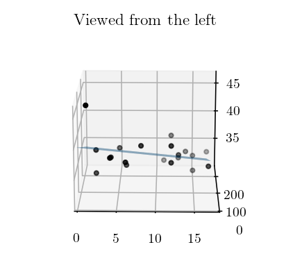
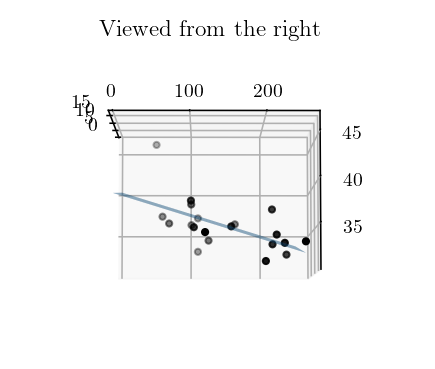

<font size="3">

[⇦ Back](../../../python.html)

```{r, echo = FALSE}
knitr::opts_chunk$set(out.width = "100%")
knitr::opts_chunk$set(engine.path = "/usr/bin/python3.11")
```

**Linear regression** involves fitting a straight-line relationship to one group of continuous numerical data that has one dependent variable and at least one independent variable. If there is only one independent variable then it is **simple** linear regression whereas more than one independent variable makes it **multiple** linear regression. In other words:

- We need to have *continuous data* (ie numbers) that come from measurements, not from ratings or scores
- A straight-line *relationship* is fitted to this data. And there is only one group which means that there is no way to look at the differences between groups.
- There is at least one independent variable and all are *true* independent variables (meaning that all other variables are being controlled for and stay the same when the independent variable in question is being read)
- The shape of the data when plotted suggests that a *straight-line* relationship is appropriate, as opposed to a parabolic line or some other curve

If the above criteria are met then, as we can see from the flowchart below, linear regression is needed.

```{r, echo=FALSE}
# install.packages("DiagrammeR", repos = "http://cran.us.r-project.org")
library(DiagrammeR)
# fillcolor='#c9daf8'
# fillcolor='#d9ead3'

DiagrammeR::grViz(
    "digraph statistical_tests {
        rankdir='LR'

        node [fontname=Helvetica, shape=box, style=filled, fillcolor=white]
        start [label='Identify the\ndependent/outcome\nvariable(s) (DVs) and\nindependent/explanatory\nvariable(s) (IVs)', fillcolor='#ea9999']
            dependent [label='Data type of\nthe DV?', fillcolor='#c9daf8']
                sc_datatypes [label='Data type of\nthe IV?', fillcolor='#c9daf8']
                    sc_true [label='True independent\nvariable?', fillcolor='#c9daf8']
                        yes_number [label='Number of\ngroups/samples\nfor the IV?', fillcolor='#c9daf8']
                            one_choose [label='Choose a fit', fillcolor='#c9daf8']
                                'Simple Linear\nRegression' [fillcolor='#d9ead3']
                                'Quadratic\nRegression' [style=rounded]
                            'Multiple Linear\nRegression' [fillcolor='#d9ead3']
                        no_parametric [label='Parametric?']
                            'Pearson\ncorrelation\ncoefficient' [style=rounded]
                            'Spearmans rank\ncorrelation\ncoefficient' [style=rounded, label=<Spearman&rsquo;s rank<BR/>correlation<BR/>coefficient>]
                    none_parametric [label='Parametric?']
                        'One-sample t-test' [style=rounded, label=<One-sample <I>t</I>-test>]
                    cd_number [label='Number of\ngroups/samples\nfor the IV?']
                        two_parametric [label='Parametric?']
                            true_independent [label='Independent\ngroups/sample?']
                                'Unpaired\ntwo-sample\nt-test' [style=rounded, label=<Unpaired<BR/>two-sample<BR/><I>t</I>-test>]
                                'Paired\ntwo-sample\nt-test' [style=rounded, label=<Paired<BR/>two-sample<BR/><I>t</I>-test>]
                            false_independent [label='Independent\ngroups/sample?']
                                'Mann-Whitney\nU test' [style=rounded, label=<Mann-Whitney<BR/> <I>U </I>test>]
                                'Wilcoxon\nsigned-rank test' [style=rounded]
                        more_parametric [label='Parametric?']
                            'ANOVA' [style=rounded]
                            false_independent2 [label='Independent\ngroups/sample?']
                                'Kruskal-Wallis\none-way ANOVA' [style=rounded]
                                'Friedman\ntwo-way ANOVA' [style=rounded]
                cd_datatype [label='Type of\ncategorical\ndata?']
                    binary_datatype [label='Data type of\nthe IV?']
                        'One-sample Z-test' [style=rounded, label=<One-sample <I>Z</I>-test>]
                        'Two-sample Z-test' [style=rounded, label=<Two-sample <I>Z</I>-test>]
                        'χ² test for trend' [style=rounded]
                    ordinal_datatype [label='Data type of\nthe IV?']
                        'χ² test for trend' [style=rounded]
                    nominal_datatype [label='Data type of\nthe IV?']
                        none_additional [label='Additional DV?']
                            'χ² goodness-of-fit test' [style=rounded]
                            'χ² independence test' [style=rounded]
                        'χ² homogeneity test' [style=rounded]

        {rank=same; start -> dependent}
        dependent -> sc_datatypes [label='Scale/\nContinuous']
            sc_datatypes -> sc_true [label='Scale/\nContinuous']
                sc_true -> yes_number [label='Yes\n(regression \nanalysis)']
                    yes_number -> one_choose [label='One']
                        one_choose -> 'Simple Linear\nRegression'
                        one_choose -> 'Quadratic\nRegression'
                    yes_number -> 'Multiple Linear\nRegression' [label='More']
                sc_true -> no_parametric [label='No\n(correlation \nanalysis)']
                    no_parametric -> 'Pearson\ncorrelation\ncoefficient' [label='Yes']
                    no_parametric -> 'Spearmans rank\ncorrelation\ncoefficient' [label='No']
            sc_datatypes -> none_parametric [label='None\n(no IV)']
                none_parametric -> 'One-sample t-test' [label='Yes']
            sc_datatypes -> cd_number [label='Categorical/\nDiscrete']
                cd_number -> two_parametric [label=Two]
                    two_parametric -> true_independent [label=Yes]
                        true_independent -> 'Unpaired\ntwo-sample\nt-test' [label=Yes]
                        true_independent -> 'Paired\ntwo-sample\nt-test' [label=No]
                    two_parametric -> false_independent [label=No]
                        false_independent -> 'Mann-Whitney\nU test' [label=Yes]
                        false_independent -> 'Wilcoxon\nsigned-rank test' [label=No]
                cd_number -> more_parametric [label=More]
                    more_parametric -> 'ANOVA' [label=Yes]
                    more_parametric -> false_independent2 [label=No]
                        false_independent2 -> 'Kruskal-Wallis\none-way ANOVA' [label=Yes]
                        false_independent2 -> 'Friedman\ntwo-way ANOVA' [label=No]
        dependent -> cd_datatype [label='Categorical/\nDiscrete']
            cd_datatype -> binary_datatype [label='Binary\n(nominal)']
                binary_datatype -> 'One-sample Z-test' [label='None\n(no IV)']
                binary_datatype -> 'Two-sample Z-test' [label='Binary\n(nominal)']
                binary_datatype -> 'χ² test for trend' [label=Ordinal]
            cd_datatype -> ordinal_datatype [label='Ordinal']
                ordinal_datatype -> 'χ² test for trend' [label='Binary\n(nominal)']
            cd_datatype -> nominal_datatype [label='Nominal\n(incl binary)']
                nominal_datatype -> none_additional [label='None\n(no IV)']
                    none_additional -> 'χ² goodness-of-fit test' [label=No]
                    none_additional -> 'χ² independence test' [label=Yes]
                nominal_datatype -> 'χ² homogeneity test' [label=Nominal]

    labelloc='t';
    label='Flowchart for Choosing a Statistical Test';
    fontsize=30;
    }",
    height=650,
    width=1000
)
```

**Simple** linear regression can be represented graphically on a 2D plot with the independent variable on the x-axis and the dependent variable on the y-axis. **Multiple** linear regression, if there are two independent variables, can be represented on a 3D plot with three axes: one independent variable on x, the other independent on y and the dependent variable on z (pointing upwards):

```{python, echo = FALSE, results = 'hide'}
from sklearn import datasets
import matplotlib.pyplot as plt
from scipy import stats as st
from scipy import optimize
import numpy as np


def fn(x, a, b, c):
    return a * x[0] + b * x[1] + c


def f(x, y):
    """z = α + β₁x + β₂y."""
    return α + β2 * x + β1 * y


# Make figures A7 in size
A = 7
plt.rc('figure', figsize=[2 * 46.82 * .5**(.5 * A), 33.11 * .5**(.5 * A)])
# Image quality
plt.rc('figure', dpi=141)
# Be able to add Latex
plt.rc('text', usetex=True)
plt.rc('font', family='serif')
plt.rc('text.latex', preamble=r'\usepackage{textgreek}')

# Load the dataset
linnerud = datasets.load_linnerud(as_frame=True)

# Multiple linear regression
xy = linnerud['data'][['Chins', 'Situps']]
z = linnerud['target']['Waist']
popt, pcov = optimize.curve_fit(fn, xy.values.T, z)
β2 = popt[0]
β1 = popt[1]
α = popt[2]

#
# Plot
#
fig = plt.figure()
# Simple linear regression
ax1 = fig.add_subplot(1, 2, 1)
x = linnerud['data']['Chins']
y = linnerud['target']['Waist']
ax1.scatter(x, y, c='k', s=10)
m, c, r, p, se = st.linregress(x, y)
xlim = ax1.get_xlim()
ax1.plot(np.array(xlim), m * np.array(xlim) + c, c='lightblue', ls='--', ms=5)
ax1.set_xlim(xlim)
ax1.set_title('Simple Linear Regression')
# Multiple linear regression
ax2 = fig.add_subplot(1, 2, 2, projection='3d')
x = linnerud['data']['Chins']
y = linnerud['data']['Situps']
z = linnerud['target']['Waist']
ax2.scatter(x, y, z, c='k', s=10)
x = np.linspace(0, x.max(), 100)
y = np.linspace(0, y.max(), 100)
X, Y = np.meshgrid(x, y)
Z = f(X, Y)
ax2.plot_surface(X, Y, Z, alpha=0.6)
xlim = ax2.get_xlim()
ylim = ax2.get_ylim()
ax2.set_xlim(0, xlim[1])
ax2.set_ylim(0, ylim[1])
ax2.set_title('Multiple Linear Regression')
# Finish
plt.tight_layout()
plt.show()
```

If there are **more than two** independent variables then it becomes difficult to represent the regression on a plot, but the idea is the same. Note that in the 2D plot the linear relationship is literally a straight line whereas in the 3D plot the linear relationship becomes a *surface* - a flat plane. It is a 'plane-of-best-fit' as opposed to a 'line-of-best-fit'.

Conceptually, multiple linear regression can be thought of as simple linear regression performed once for each independent variable. If we take the multiple linear regression shown above in the figure on the right, rotate it and view it end-on from two sides we can see that it's just two straight-line relationships:



So multiple linear regression is *literally* linear regression done multiple times!

Packages
========
The code on this page uses the scikit-learn, Matplotlib, NumPy, SciPy, Pandas and Statsmodels packages. These can be installed from the terminal with:

```{bash, eval = FALSE}
$ python3.11 -m pip install sklearn
$ python3.11 -m pip install matplotlib
$ python3.11 -m pip install numpy
$ python3.11 -m pip install scipy
$ python3.11 -m pip install pandas
$ python3.11 -m pip install statsmodels
```

where `python3.11` corresponds to the version of Python you have installed and are using.

Example Data
============
For this example we're going to use the Linnerud dataset from scikit-learn. This contains physical exercise data from 20 volunteers (middle-aged non-elite-athlete men) that can be used as *explanatory variables* (independent variables) to explain the *scalar response* or *target* (dependent variable) which, in this case, is physiological health.

In particular, this example will use the number of chin-ups and sit-ups completed by each volunteer (metrics of physical performance) as the independent variables, and the volunteers' waist circumferences (metric of physiological health) as the dependent variable:

```{python}
from sklearn import datasets

# Load the dataset
linnerud = datasets.load_linnerud(as_frame=True)

# Extract the relevant data
xy = linnerud['data'][['Chins', 'Situps']]
z = linnerud['target']['Waist']

print(xy.join(z))
```

Exploring the Data
==================
To make an initial decision as to what summary model to use, plot the raw data:

```{python, eval = FALSE}
import matplotlib.pyplot as plt

x = linnerud['data']['Chins']
y = linnerud['data']['Situps']
z = linnerud['target']['Waist']

# Plot
fig = plt.figure()
ax = fig.add_subplot(projection='3d')
ax.scatter(x, y, z)
ax.set_title('Raw Data from the Linnerud Dataset')
ax.set_xlabel('Chin-Ups')
ax.set_ylabel('Sit-Ups')
ax.set_zlabel('Waist Circumference [in]')
xlim = ax.get_xlim()
ylim = ax.get_ylim()
ax.set_xlim(0, xlim[1])
ax.set_ylim(0, ylim[1])
plt.show()
```

```{python, echo = FALSE, results = 'hide'}
import matplotlib.pyplot as plt

x = linnerud['data']['Chins']
y = linnerud['data']['Situps']
z = linnerud['target']['Waist']

# Plot
fig = plt.figure()
ax = fig.add_subplot(projection='3d')
ax.scatter(x, y, z)
ax.set_title('Raw Data from the Linnerud Dataset')
ax.set_xlabel('Chin-Ups')
ax.set_ylabel('Sit-Ups')
ax.set_zlabel('Waist Circumference [in]')
xlim = ax.get_xlim()
ylim = ax.get_ylim()
ax.set_xlim(0, xlim[1])
ax.set_ylim(0, ylim[1])
plt.show()
```

Note, when running this in Python we can actually get a 3D model to appear in a pop-up window. This can be moved around with the mouse to get a much better idea of how the data is spread around in space:

```{python, eval = FALSE}
import matplotlib

matplotlib.use('TkAgg')

plt.show()
```

This requires the 'tkinter' (Tk interface) package to be installed. To do this, run the following from the terminal:

```{bash, eval = FALSE}
$ sudo apt-get install python3-tk
```

In lieu of that, here's the same data in two 2D plots:

```{python}
# Make figures A7 in size
A = 7
plt.rc('figure', figsize=[2 * 46.82 * .5**(.5 * A), 33.11 * .5**(.5 * A)])

# Whole figure
fig = plt.figure()
plt.suptitle('Raw Data from the Linnerud Dataset')

# Left-hand plot
ax1 = fig.add_subplot(1, 2, 1)
ax1.scatter(x, z, c='k', s=10)
ax1.set_xlabel('Chin-Ups')
ax1.set_ylabel('Waist Circumference [in]')

# Right-hand plot
ax2 = fig.add_subplot(1, 2, 2)
ax2.scatter(y, z, c='k', s=10)
ax2.set_xlabel('Sit-Ups')
ax2.set_ylabel('Waist Circumference [in]')

plt.tight_layout()
plt.show()
```

A multiple linear regression model does indeed seem appropriate in this case because, for both independent variables, waist circumference roughly decreases as the variable increases.

Fitting the Model
=================
The full 3D multiple linear regression model is represented by the equation z = β₁x + β₂y + α where:

- x and y are the **independent variables** (chin-ups and sit-ups)
- z is the **dependent variable** (waist circumference)
- β₁ and β₂ are the **coefficients** of the independent variables
- α is the **intercept** of the z-axis (the value of z when x and y are 0)
- β₁, β₂ and α together are the **parameters**
- The full equation z = β₁x + β₂y + α creates a **surface** when plotted on a 3D plot with axes x, y & z when the values of parameters β₁, β₂ and α are known

A *hypothesis test* is performed for each of the parameters. In each case, the null hypothesis is that the parameter in question is equal to zero and the alternative hypothesis is that it is not.

Fitting the model can be split into two steps: (1) estimating values for the parameters and (2) calculating the results of the statistical tests relevant to these parameters. In Python, I have found five 'methods' of doing this (in reality they are the same method, just done using five different functions):

Using NumPy for the Parameter Estimations
-----------------------------------------
NumPy contains the `np.linalg.lstsq()` function which performs least-squares optimisation. We can use this for linear regression, although our data needs to have a constant term added to it before it will work. You can do this with `xy['Constant'] = 1` before doing the optimisation:

```{python}
import numpy as np

# Independent variables
xy = linnerud['data'][['Chins', 'Situps']]
# Add a column with a constant
xy['Constant'] = 1
# Dependent variable
z = linnerud['target']['Waist']

# Perform multiple linear regression
returns = np.linalg.lstsq(xy, z, rcond=None)
```

Now we can extract the parameter estimations from the optimisation's returns:

```{python}
# Get the parameters
params = returns[0]
# Get the coefficients
β1 = params[0]
β2 = params[1]
# Get the intercept
α = params[2]

# z = β₁x + β₂y + α
print(f'The full multiple linear regression model: z = {β1:-.3f}x {β2:=+7.3f}y {α:=+8.3f}')
```

Now calculate the p-values and the 95% confidence interval:

```{python}
from scipy import stats as st

# Sum of squared residuals
# (this is returned from the np.linalg.lstsq() function)
sum_sq_residuals = returns[1]
# Degrees of freedom (sample size - number of parameters)
dof = len(xy) - len(params)
# Mean squared error
mse = sum_sq_residuals / dof
# Covariances of the parameters ('@'' is the dot product)
cov = mse * np.diagonal(np.linalg.inv(xy.T @ xy))
# Standard errors of the parameters
se = np.sqrt(cov)
# t-statistics associated with the parameters
t_statistics = params / se
# Two-tailed test
tails = 2
# Calculate the p-values
p_values = [tails * (1 - st.t.cdf(np.abs(t), dof)) for t in t_statistics]
# Significance level
alpha = 0.05
# Percent-point function (aka quantile function) of the t-distribution
t = st.t.ppf(1 - (alpha / tails), dof)
# Margin of error
d = t * se
# 95% confidence interval
upper_ci = params + d
lower_ci = params - d
```

Display the results:

```{python}
import pandas as pd

pd.set_option('display.max_columns', 20)
pd.set_option('display.width', 200)

# Display the results
output = [params, se, t_statistics, p_values, lower_ci, upper_ci]
index = ['Value', 'Standard Error', 't-Statistic', 'p-Value', 'Lower CI', 'Upper CI']
output = pd.DataFrame(output, index=index, columns=list(xy)).round(3)
output = output.T
output.insert(0, 'Parameter', ['β₁', 'β₂', 'α'])

print(output)
```

Using SciPy for the Parameter Estimations
-----------------------------------------
SciPy contains `optimize.curve_fit()` which also performs optimisation. You *don't* need to add in the constant term but you *do* need to define the model as a function:

```{python}
from scipy import optimize


def fn(x, a, b, c):
    """z = β₁x + β₂y + α."""
    return a * x[0] + b * x[1] + c


# Independent variables
xy = linnerud['data'][['Chins', 'Situps']]
# Dependent variable
z = linnerud['target']['Waist']

# Perform multiple linear regression
popt, pcov = optimize.curve_fit(fn, xy.values.T, z)
```

Extract the parameter estimations:

```{python}
# Get the parameters
β1 = popt[0]
β2 = popt[1]
α = popt[2]

# z = β₁x + β₂y + α
print(f'The full multiple linear regression model: z = {β1:-.3f}x {β2:=+7.3f}y {α:=+8.3f}')
```

Now calculate the p-values and the 95% confidence interval:

```{python}
# Re-format to align with NumPy
params = popt
xy['Constant'] = 1

# Covariances of the parameters
# (this is returned from the optimize.curve_fit() function)
cov = np.diagonal(pcov)
# Standard errors of the parameters
se = np.sqrt(cov)
# t-statistics associated with the parameters
t_statistics = params / se
# Two-tailed test
tails = 2
# Degrees of freedom (sample size - number of parameters)
dof = len(xy) - len(popt)
# Calculate the p-values
p_values = [tails * (1 - st.t.cdf(np.abs(t), dof)) for t in t_statistics]
# Significance level
alpha = 0.05
# Percent-point function (aka quantile function) of the t-distribution
t = st.t.ppf(1 - (alpha / tails), dof)
# Margin of error
d = t * se
# 95% confidence interval
upper_ci = params + d
lower_ci = params - d
```

Display the results:

```{python}
pd.set_option('display.max_columns', 20)
pd.set_option('display.width', 200)

# Display the results
output = [params, se, t_statistics, p_values, lower_ci, upper_ci]
index = ['Value', 'Standard Error', 't-Statistic', 'p-Value', 'Lower CI', 'Upper CI']
output = pd.DataFrame(output, index=index, columns=list(xy)).round(3)
output = output.T
output.insert(0, 'Parameter', ['β₁', 'β₂', 'α'])

print(output)
```

Using Statsmodels's API
-----------------------
Statsmodels actually provides three equivalent ways to perform optimisation via ordinary least-squares. The first is `OLS()` which, again, requires that you manually add a constant:

```{python}
import statsmodels.api as sm

# Independent variables
xy = linnerud['data'][['Chins', 'Situps']]
# Add a column with a constant
xy['Constant'] = 1
# Dependent variable
z = linnerud['target']['Waist']

# Perform multiple linear regression using ordinary least-squares
model = sm.OLS(z, xy)
# Fit the model
results = model.fit()
```

Statsmodels calculates *everything* in the background, so here are all our results:

```{python}
print(results.summary())
```

...and here's how to extract them:

```{python}
output = [results.params, results.bse, results.tvalues, results.pvalues, results.conf_int()]
output = pd.concat(output, axis=1).round(3)
output.columns = ['Value', 'Standard Error', 't-Statistic', 'p-Value', 'Lower CI', 'Upper CI']
output.insert(0, 'Parameter', ['β₁', 'β₂', 'α'])

print(output)
```

For the record, here's how to do it 'manually':

```{python}
# Get the parameters
β1 = results.params[0]
β2 = results.params[1]
α = results.params[2]

# z = β₁x + β₂y + α
print(f'The full multiple linear regression model: z = {β1:-.3f}x {β2:=+7.3f}y {α:=+8.3f}')
```

Calculate the p-values and 95% confidence interval:

```{python}
# Fit the model to the raw data: z = β₁x + β₂y + α
z_fitted = β1 * linnerud['data']['Chins'] + β2 * linnerud['data']['Situps'] + α
# Sum of squared residuals
sum_sq_residuals = sum((z - z_fitted)**2)
# Degrees of freedom (sample size - number of parameters)
dof = len(xy) - len(results.params)
# Mean squared error
mse = sum_sq_residuals / dof
# Covariances of the parameters ('@'' is the dot product)
cov = mse * np.diagonal(np.linalg.inv(xy.T @ xy))
# Standard errors of the parameters
se = np.sqrt(cov)
# t-statistics associated with the parameters
t_statistics = results.params / se
# Two-tailed test
tails = 2
# Calculate the p-values
p_values = [tails * (1 - st.t.cdf(np.abs(t), dof)) for t in t_statistics]
# Significance level
alpha = 0.05
# Percent-point function (aka quantile function) of the t-distribution
t = st.t.ppf(1 - (alpha / tails), dof)
# Margin of error
d = t * se
# 95% confidence interval
upper_ci = results.params + d
lower_ci = results.params - d
```

Display the results:

```{python}
pd.set_option('display.max_columns', 20)
pd.set_option('display.width', 200)

# Display the results
output = [results.params, t_statistics, lower_ci, upper_ci]
output = pd.concat(output, axis=1)
output.columns = ['Value', 't-Statistic', 'Lower CI', 'Upper CI']
output.insert(1, 'Standard Error', se)
output.insert(3, 'p-Value', p_values)
output = output.round(3)
output.insert(0, 'Parameter', ['β₁', 'β₂', 'α'])

print(output)
```

Using Statsmodels's Regression
------------------------------
This is the same as Statsmodels API's `OLS()` but imported a different way. This is just to show that they are indeed the same:

```{python}
from statsmodels import regression

# Independent variables
xy = linnerud['data'][['Chins', 'Situps']]
# Add a column with a constant
xy['Constant'] = 1
# Dependent variable
z = linnerud['target']['Waist']

# Perform multiple linear regression using ordinary least squares
model = regression.linear_model.OLS(z, xy)
# Fit the model
results = model.fit()

print(results.summary())
```

Get the parameters:

```{python}
# Get the parameters
β1 = results.params[0]
β2 = results.params[1]
α = results.params[2]

# z = β₁x + β₂y + α
print(f'The full multiple linear regression model: z = {β1:-.3f}x {β2:=+7.3f}y {α:=+8.3f}')
```

Using Statsmodels's Formula API
-------------------------------
This gives us `ols()` (lowercase) whereas in the previous two examples we used `OLS()` (uppercase). This is a *function* (as opposed to a *class*, which is what `OLS()` is) and it:

- Adds the constant for you
- Uses the 'R-style' formula notation for the model: z ~ x + y where the tilde (~) means that z "is linearly modelled by" x and y combined
- Swaps the parameters around so that the model equation becomes z = α + β₁x + β₂y

```{python}
import statsmodels.formula.api as smf

# Independent variables
xy = linnerud['data'][['Chins', 'Situps']]
# Dependent variable
z = linnerud['target']['Waist']
# Combine the datasets
df = pd.merge(xy, z, left_index=True, right_index=True)

# Perform multiple linear regression using ordinary least squares
model = smf.ols(formula='Waist ~ Chins + Situps', data=df)
# Fit the model
results = model.fit()

print(results.summary())
```

Extract the parameter estimations:

```{python}
# Get the parameters
α = results.params[0]
β1 = results.params[1]
β2 = results.params[2]

# z = α + β₁x + β₂y
print(f'The full multiple linear regression model: z = {α:.3f} {β1:=+7.3f}x {β2:=+7.3f}y')
```

Display the results:

```{python}
pd.set_option('display.max_columns', 20)
pd.set_option('display.width', 200)

output = [results.params, results.bse, results.tvalues, results.pvalues, results.conf_int()]
output = pd.concat(output, axis=1).round(3)
output.columns = ['Value', 'Standard Error', 't-Statistic', 'p-Value', 'Lower CI', 'Upper CI']
output.insert(0, 'Parameter', ['α', 'β₁', 'β₂'])

print(output)
```

Using scikit-learn
------------------
scikit-learn is a package aimed primarily at machine learning. For this reason it requires a linear regression model to be 'trained' and then 'fitted'. You don't need to add the constant to the raw data:

```{python}
from sklearn import linear_model

# Independent variables
XY = linnerud['data'][['Chins', 'Situps']]
# Dependent variable
Z = linnerud['target']['Waist']

# Perform multiple linear regression
mlr = linear_model.LinearRegression()
# Fit the model
mlr.fit(XY, Z)

# Get the coefficients
β1 = mlr.coef_[0]
β2 = mlr.coef_[1]
# Get the intercept
α = mlr.intercept_

# z = β₁x + β₂y + α
print(f'The full multiple linear regression model: z = {β1:-.3f}x {β2:=+7.3f}y {α:=+8.3f}')
```

Calculate the p-values and the 95% confidence interval:

```{python}
# Re-format the results of the linear regression
params = np.append(mlr.coef_, mlr.intercept_)
# Use the model to predict other output values
predictions = mlr.predict(XY)
# Sum of squared residuals
sum_sq_residuals = sum((Z - predictions)**2)
# Degrees of freedom (sample size - number of parameters)
dof = len(XY) - len(params)
# Mean squared error
mse = sum_sq_residuals / dof
# Add a constant
XY['Constant'] = 1
# Covariances of the parameters ('@'' is the dot product)
cov = mse * np.diagonal(np.linalg.inv(XY.T @ XY))
# Standard errors of the parameters
se = np.sqrt(cov)
# t-statistics associated with the parameters
t_statistics = params / se
# Two-tailed test
tails = 2
# Calculate the p-values
p_values = [tails * (1 - st.t.cdf(np.abs(t), dof)) for t in t_statistics]
# Significance level
alpha = 0.05
# Percent-point function (aka quantile function) of the t-distribution
t = st.t.ppf(1 - (alpha / tails), dof)
# Margin of error
d = t * se
# 95% confidence interval
upper_ci = params + d
lower_ci = params - d
```

Display the results:

```{python}
pd.set_option('display.max_columns', 20)
pd.set_option('display.width', 200)

# Display the results
output = [params, se, t_statistics, np.array(p_values), lower_ci, upper_ci]
index = ['Value', 'Standard Error', 't-Statistic', 'p-Value', 'Lower CI', 'Upper CI']
output = pd.DataFrame(output, index=index, columns=list(XY)).round(3)
output = output.T
output.insert(0, 'Parameter', ['β₁', 'β₂', 'α'])

print(output)
```

Plot the Results
================

```{python, eval = FALSE}
def f(x, y):
    """
    Define the model as a function.

    z = α + β₁x + β₂y
    """
    return α + β1 * x + β2 * y


# Create plot
fig = plt.figure()
ax = fig.add_subplot(projection='3d')

# Scatter plot
#
# Independent variables
x = linnerud['data']['Chins']
y = linnerud['data']['Situps']
# Dependent variable
z = linnerud['target']['Waist']
# Scatter plot
ax.scatter(x, y, z)

# Surface plot
#
# Independent variables
x = np.linspace(0, linnerud['data']['Chins'].max(), 100)
y = np.linspace(0, linnerud['data']['Situps'].max(), 100)
X, Y = np.meshgrid(x, y)
# Dependent variable
Z = f(X, Y)
# Surface plot
ax.plot_surface(X, Y, Z, cmap='binary', alpha=0.6)

# Title and labels
ax.set_title('Multiple Linear Regression')
ax.set_xlabel('Chin-Ups')
ax.set_ylabel('Sit-Ups')
ax.set_zlabel('Waist Circumference [in]')

# Set the limits
xlim = ax.get_xlim()
ylim = ax.get_ylim()
ax.set_xlim(0, xlim[1])
ax.set_ylim(0, ylim[1])

plt.show()
```

```{python, echo = FALSE, results = 'hide'}
def f(x, y):
    """
    Define the model as a function.

    z = α + β₁x + β₂y
    """
    return α + β1 * x + β2 * y


# Create plot
fig = plt.figure()
ax = fig.add_subplot(projection='3d')

# Scatter plot
#
# Independent variables
x = linnerud['data']['Chins']
y = linnerud['data']['Situps']
# Dependent variable
z = linnerud['target']['Waist']
# Scatter plot
ax.scatter(x, y, z)

# Surface plot
#
# Independent variables
x = np.linspace(0, linnerud['data']['Chins'].max(), 100)
y = np.linspace(0, linnerud['data']['Situps'].max(), 100)
X, Y = np.meshgrid(x, y)
# Dependent variable
Z = f(X, Y)
# Surface plot
ax.plot_surface(X, Y, Z, cmap='binary', alpha=0.6)

# Title and labels
ax.set_title('Multiple Linear Regression')
ax.set_xlabel('Chin-Ups')
ax.set_ylabel('Sit-Ups')
ax.set_zlabel('Waist Circumference [in]')

# Set the limits
xlim = ax.get_xlim()
ylim = ax.get_ylim()
ax.set_xlim(0, xlim[1])
ax.set_ylim(0, ylim[1])

plt.show()
```

Interpretation of the Results
=============================
As stated multiple times, the full multiple linear regression model is z = -0.121x - 0.026y + 40.317. The interpretation of this is that:

- 0.121 inches is the loss of waist circumference for each additional chin-up that someone can do
- 0.026 inches is the loss of waist circumference for each additional sit-up that someone can do
- 40.317 inches would be the waist circumference of someone who can do 0 chin-ups and 0 sit-ups. Of course, these values lie outside our range of observed data and so this statement constitutes **extrapolation**. Our model is not guaranteed to be robust enough to enable extrapolation. However, **interpolation** could be done to predict the waist circumference of someone who can do between 1 and 17 chin-ups and between 50 and 251 sit-ups (the minimum and maximum values we observed in our raw data)

The p-value associated with the chin-ups parameter is 0.441 which is larger than 0.1. This means we fail to reject the null hypothesis at the 0.1 significance level and acknowledge that β₁ might be equal to zero. In other words, the true effect of the number of chin-ups someone can do on their waist circumference is probably negligible. Possibly, this parameter could be removed from the model.

The 95% confidence intervals for each of the parameters can be used to generalise the model to the target population (middle-aged non-elite-athlete men). We can say that, for 95% of the target population, the relationship between their chin-ups, sit-ups and waist circumference numbers will fall within the bounds of the model's confidence intervals.

[⇦ Back](../../../python.html)

</font>
