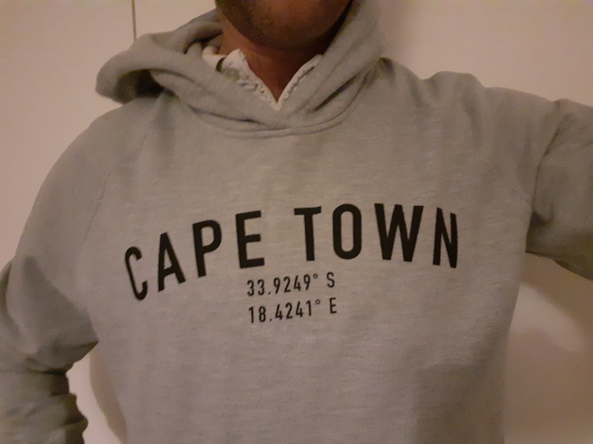
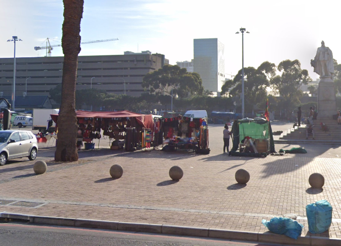

<font size="3">

[⇦ Back](../../../python.html)

I recently got a hoodie as a gift:

<center>

{width=400px}

</center>

It's very nice, and I do indeed come from Cape Town. The coordinates interested me though: 33.9249°S, 18.4241°E. Four decimal places! It reminded me of [this](https://xkcd.com/2170/) xkcd comic:

<center>

Coordinate Precision
====================


</center>

So if four decimal places means that you're pointing to a particular corner of a house, is it really representative to use this precision to refer to the entire city of Cape Town? I thought I would use Python to investigate...

Python Packages
---------------
The code on this page uses the Folium and SciPy packages. These can be installed from the terminal with the following commands:

```bash
# `python3.12` corresponds to the version of Python you have installed and are using
$ python3.12 -m pip install folium
$ python3.12 -m pip install scipy
```

Once finished, import these packages into your Python script as follows:

```{python}
import folium
import itertools
import numpy as np
```

Four Decimal Places
-------------------
Using the Folium package I can draw a box on an OpenStreetMap and see just what's underneath the coordinates as shown on my hoodie:

```{python, eval = FALSE}
# Coordinates on my hoodie
lat = -33.9249  # °S
lon = 18.4241  # °E

# Implied resolution
bounding_box = (
    -33.92485, -33.92495,  # Latitudes
    18.42405, 18.42415,  # Longitudes
)

# Create the map
mid_lat = np.mean([bounding_box[0], bounding_box[1]])
mid_lon = np.mean([bounding_box[2], bounding_box[3]])
m = folium.Map(location=[mid_lat, mid_lon], zoom_start=18)

# Define the corners of the bounding box
corners = [
    [bounding_box[0], bounding_box[2]],  # Top-left
    [bounding_box[0], bounding_box[3]],  # Top-right
    [bounding_box[1], bounding_box[3]],  # Bottom-right
    [bounding_box[1], bounding_box[2]],  # Bottom-left
]

# Get the adjacent pairs of corners
adjacent_corners = [[corners[i - 1], corners[i]] for i in range(len(corners))]

# Plot lines between the adjacent pairs of corners
for pair in adjacent_corners:
    folium.PolyLine(pair).add_to(m)

# Export the map
m.save('map_4dp.html')
```

{width=100% height=400px}

Hmm, it seems that the coordinates on my hoodie are pointing at a random part of Grand Parade between a palm tree and the statue of Edward VII. If I look on Google Street View I see that there was a market stall selling bags at that location at the time of the photo:

<center>

{width=400px}

</center>

I somehow doubt that the makers of the hoodie were aware that this particular patch was what they were referring to when they put these coordinates under the words "Cape Town". But what should they have used instead? Let's see what area would have been represented if they had chosen to use three decimal places instead of four:

Three Decimal Places
--------------------

```{python}
# Coordinates on my hoodie
lat = -33.925  # °S
lon = 18.424  # °E

# Implied resolution
bounding_box = (
    -33.9245, -33.9255,  # Latitudes
    18.4235, 18.4245,  # Longitudes
)
```

```{python, echo = FALSE, eval = FALSE}
# Create the map
mid_lat = np.mean([bounding_box[0], bounding_box[1]])
mid_lon = np.mean([bounding_box[2], bounding_box[3]])
m = folium.Map(location=[mid_lat, mid_lon], zoom_start=18)

# Define the corners of the bounding box
corners = [
    [bounding_box[0], bounding_box[2]],  # Top-left
    [bounding_box[0], bounding_box[3]],  # Top-right
    [bounding_box[1], bounding_box[3]],  # Bottom-right
    [bounding_box[1], bounding_box[2]],  # Bottom-left
]

# Get the adjacent pairs of corners
adjacent_corners = [[corners[i - 1], corners[i]] for i in range(len(corners))]

# Plot lines between the adjacent pairs of corners
for pair in adjacent_corners:
    folium.PolyLine(pair).add_to(m)

# Export the map
m.save('map_3dp.html')
```

{width=100% height=400px}

As the xkcd comic says, using three decimal places represents an area similar to a suburban cul-de-sac. We can do better if we want to refer to a entire city!

Two Decimal Places
------------------

```{python}
# Coordinates on my hoodie
lat = -33.93  # °S
lon = 18.42  # °E

# Implied resolution
bounding_box = (
    -33.925, -33.935,  # Latitudes
    18.415, 18.425,  # Longitudes
)
```

```{python, echo = FALSE, eval = FALSE}
# Create the map
mid_lat = np.mean([bounding_box[0], bounding_box[1]])
mid_lon = np.mean([bounding_box[2], bounding_box[3]])
m = folium.Map(location=[mid_lat, mid_lon], zoom_start=14)

# Define the corners of the bounding box
corners = [
    [bounding_box[0], bounding_box[2]],  # Top-left
    [bounding_box[0], bounding_box[3]],  # Top-right
    [bounding_box[1], bounding_box[3]],  # Bottom-right
    [bounding_box[1], bounding_box[2]],  # Bottom-left
]

# Get the adjacent pairs of corners
adjacent_corners = [[corners[i - 1], corners[i]] for i in range(len(corners))]

# Plot lines between the adjacent pairs of corners
for pair in adjacent_corners:
    folium.PolyLine(pair).add_to(m)

# Export the map
m.save('map_2dp.html')
```

{width=100% height=400px}

Ok, we're now looking at an area roughly equal to that of the City Centre - certainly a reasonable option to use when referring to the location of Cape Town. However, we can now see a new problem: the grid blocks that are defined by latitudes and longitudes do not line up nicely with the central area of Cape Town! The parliament buildings and City Hall are not in the same grid block as the castle which is not in the same grid block as the CBD. Let's try zooming out one more time to see if we can include all of what we consider to be inside 'Cape Town':

One Decimal Place
-----------------

```{python}
# Coordinates on my hoodie
lat = -33.9  # °S
lon = 18.4  # °E

# Implied resolution
bounding_box = (
    -33.85, -33.95,  # Latitudes
    18.35, 18.45,  # Longitudes
)
```

```{python, echo = FALSE, eval = FALSE}
# Create the map
mid_lat = np.mean([bounding_box[0], bounding_box[1]])
mid_lon = np.mean([bounding_box[2], bounding_box[3]])
m = folium.Map(location=[mid_lat, mid_lon], zoom_start=12)

# Define the corners of the bounding box
corners = [
    [bounding_box[0], bounding_box[2]],  # Top-left
    [bounding_box[0], bounding_box[3]],  # Top-right
    [bounding_box[1], bounding_box[3]],  # Bottom-right
    [bounding_box[1], bounding_box[2]],  # Bottom-left
]

# Get the adjacent pairs of corners
adjacent_corners = [[corners[i - 1], corners[i]] for i in range(len(corners))]

# Plot lines between the adjacent pairs of corners
for pair in adjacent_corners:
    folium.PolyLine(pair).add_to(m)

# Export the map
m.save('map_1dp.html')
```

{width=100% height=400px}

This block definitely contains the whole of the City Centre, but it also contains more ocean than it does land! Perhaps we've zoomed out too far by using only one decimal place? But using two decimal places doesn't quite line up with the City Centre, so what should the makers of the hoodie have done?

In my opinion, two decimal places is probably the best option. So here's my improved version that I will be asking for next Christmas:

<center>

{width=400px}

</center>

[⇦ Back](../../../python.html)

</font>
