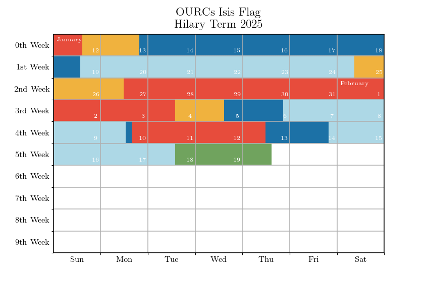
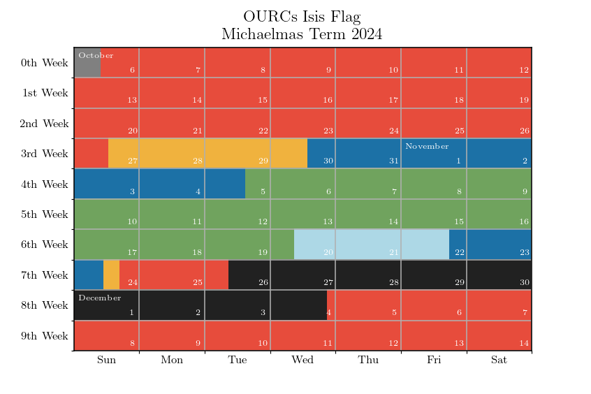
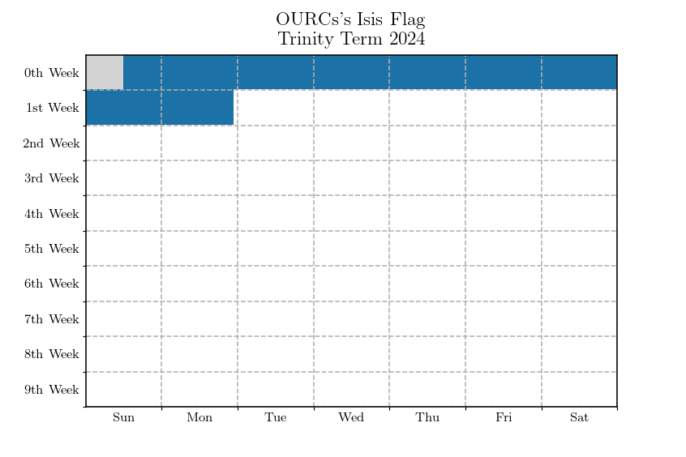
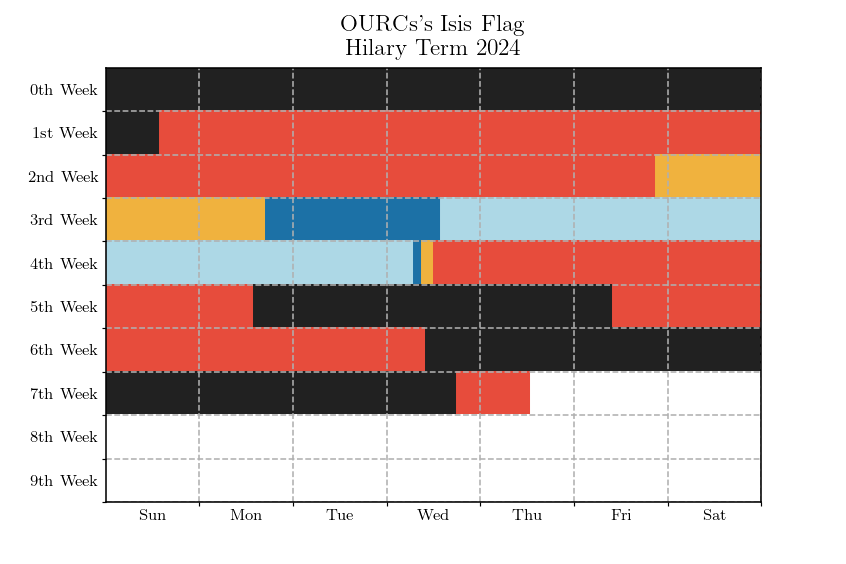
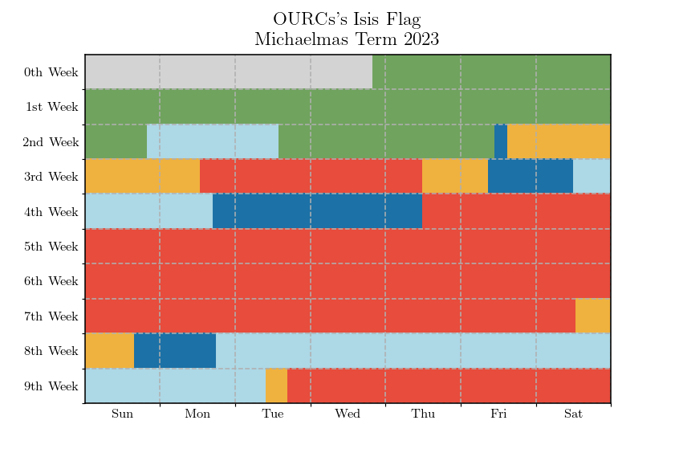
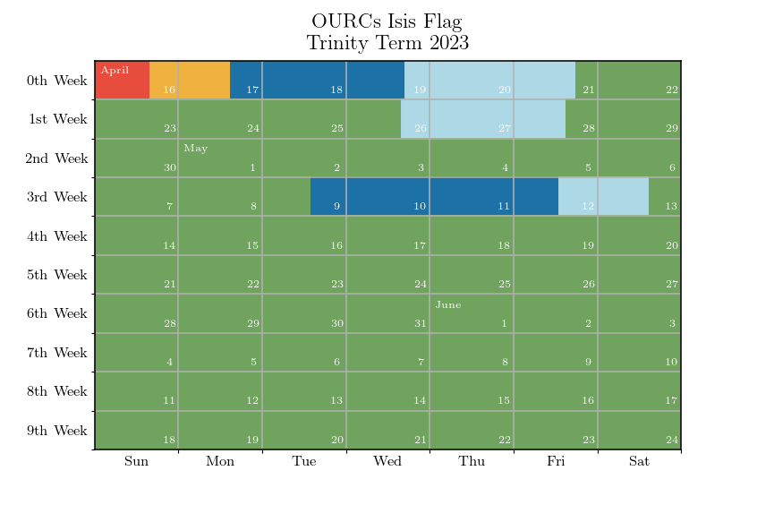
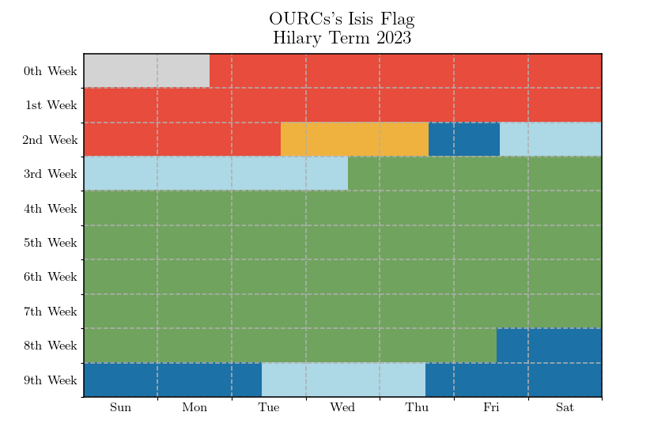

{.tabset}
---------

### 2025 {.tabset}

#### Hilary {.tabset}



```{python, echo = FALSE, results = 'asis'}
f = open('isis_flag_history/2025_hilary_term.txt', 'r')
content = f.read()
print(content)
f.close()
```

<br>

### 2024 {.tabset}

#### Michaelmas {.tabset}



```{python, echo = FALSE, results = 'asis'}
f = open('isis_flag_history/2024_michaelmas_term.txt', 'r')
content = f.read()
print(content)
f.close()
```

<br>

#### Trinity {.tabset}



```{python, echo = FALSE, results = 'asis'}
f = open('isis_flag_history/2024_trinity_term.txt', 'r')
content = f.read()
print(content)
f.close()
```

<br>

#### Hilary {.tabset}



```{python, echo = FALSE, results = 'asis'}
f = open('isis_flag_history/2024_hilary_term.txt', 'r')
content = f.read()
print(content)
f.close()
```

<br>

### 2023 {.tabset}

#### Michaelmas {.tabset}



```{python, echo = FALSE, results = 'asis'}
f = open('isis_flag_history/2023_michaelmas_term.txt', 'r')
content = f.read()
print(content)
f.close()
```

<br>

#### Trinity {.tabset}



```{python, echo = FALSE, results = 'asis'}
f = open('isis_flag_history/2023_trinity_term.txt', 'r')
content = f.read()
print(content)
f.close()
```

<br>

#### Hilary {.tabset}



```{python, echo = FALSE, results = 'asis'}
f = open('isis_flag_history/2023_hilary_term.txt', 'r')
content = f.read()
print(content)
f.close()
```

<br>

Links
-----
- OURCs's [Isis Flag Page](https://ourcs.co.uk/information/flags/isis/)
- Anu Dudhia's [Isis Level](https://eodg.atm.ox.ac.uk/user/dudhia/rowing/river.html)
- Jameson Lee and Joe Hitchen's [Isis Flag Differential](https://flags.jamesonlee.com/)
- Arthur Bullard's guide to [Reading the lock](https://www.photonhunter.co.uk/~art/rowing/bucks.html) at Iffley

<br>

```{python, echo = FALSE, results = 'asis'}
from datetime import datetime

print(f'*Last updated: {datetime.today().strftime('%Y-%m-%d %H:%M')}*')
```
