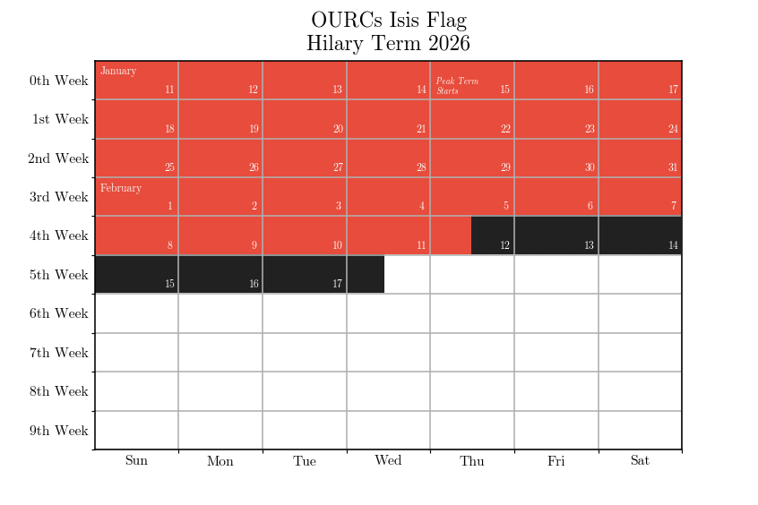
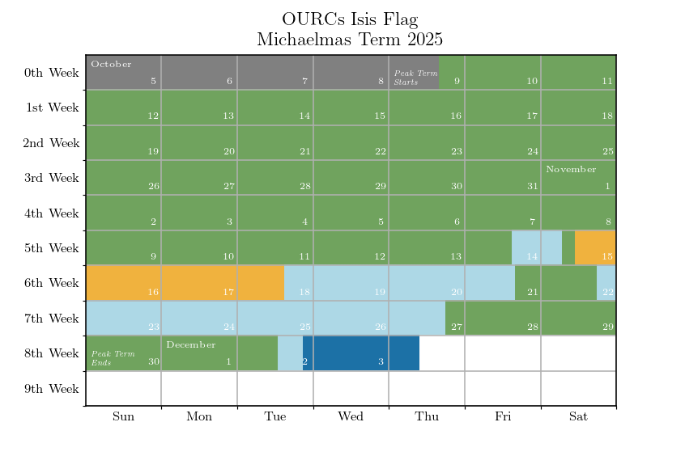
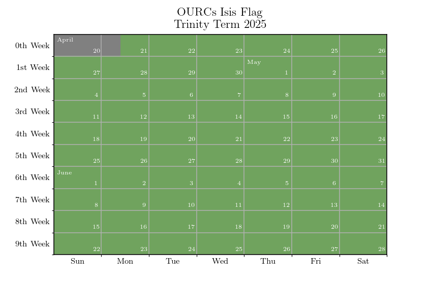
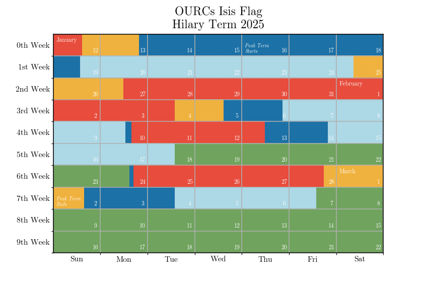
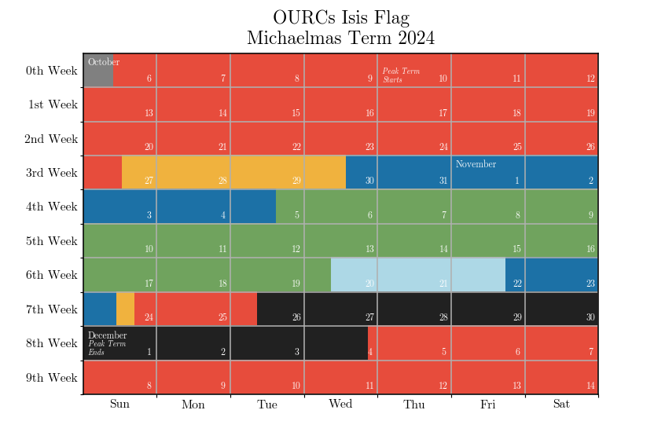
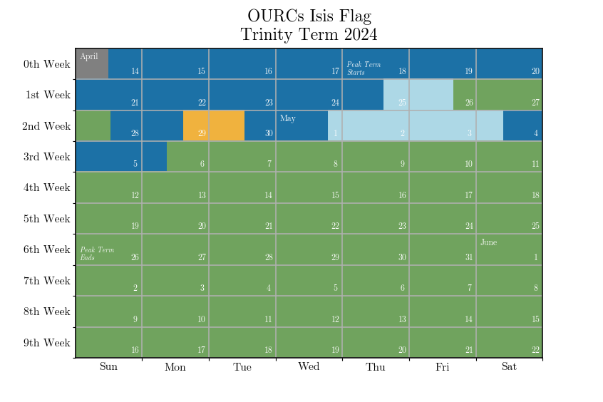
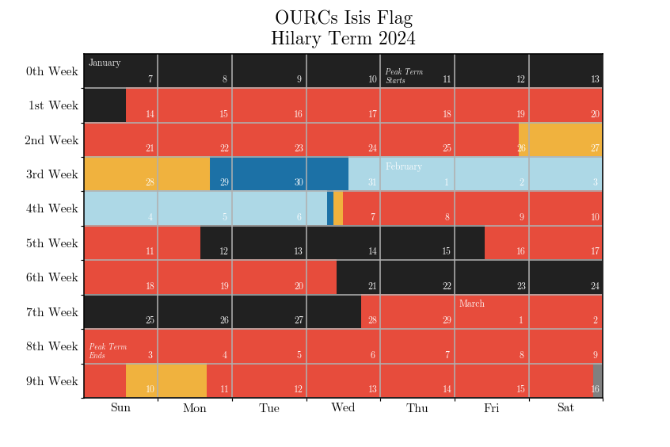
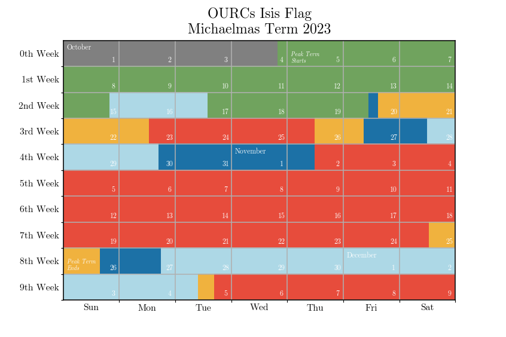
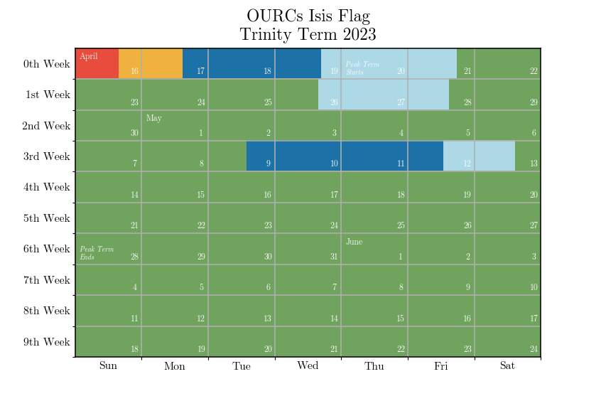
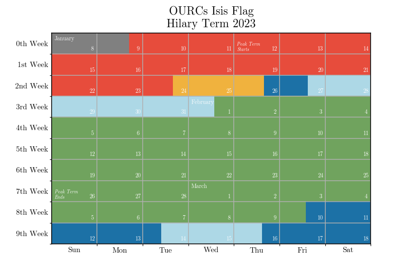

```{r setup, echo=FALSE}
library(knitr)
```

{.tabset}
---------

### 2026 {.tabset}

#### Hilary {.tabset}

```{r, echo=FALSE, results='asis', out.width='100%'}

cat(readLines('isis_flag_history/2026_hilary_term.txt'), sep = '\n')
cat('\n<br>\n')
```

### 2025 {.tabset}

#### Michaelmas {.tabset}

```{r, echo=FALSE, results='asis', out.width='100%'}

cat(readLines('isis_flag_history/2025_michaelmas_term.txt'), sep = '\n')
cat('\n<br>\n')
```

#### Trinity {.tabset}

```{r, echo=FALSE, results='asis', out.width='100%'}

cat(readLines('isis_flag_history/2025_trinity_term.txt'), sep = '\n')
cat('\n<br>\n')
```

#### Hilary {.tabset}

```{r, echo=FALSE, results='asis', out.width='100%'}

cat(readLines('isis_flag_history/2025_hilary_term.txt'), sep = '\n')
cat('\n<br>\n')
```

### 2024 {.tabset}

#### Michaelmas {.tabset}

```{r, echo=FALSE, results='asis', out.width='100%'}

cat(readLines('isis_flag_history/2024_michaelmas_term.txt'), sep = '\n')
cat('\n<br>\n')
```

#### Trinity {.tabset}

```{r, echo=FALSE, results='asis', out.width='100%'}

cat(readLines('isis_flag_history/2024_trinity_term.txt'), sep = '\n')
cat('\n<br>\n')
```

#### Hilary {.tabset}

```{r, echo=FALSE, results='asis', out.width='100%'}

cat(readLines('isis_flag_history/2024_hilary_term.txt'), sep = '\n')
cat('\n<br>\n')
```

### 2023 {.tabset}

#### Michaelmas {.tabset}

```{r, echo=FALSE, results='asis', out.width='100%'}

cat(readLines('isis_flag_history/2023_michaelmas_term.txt'), sep = '\n')
cat('\n<br>\n')
```

#### Trinity {.tabset}

```{r, echo=FALSE, results='asis', out.width='100%'}

cat(readLines('isis_flag_history/2023_trinity_term.txt'), sep = '\n')
cat('\n<br>\n')
```

#### Hilary {.tabset}

```{r, echo=FALSE, results='asis', out.width='100%'}

cat(readLines('isis_flag_history/2023_hilary_term.txt'), sep = '\n')
cat('\n<br>\n')
```

Links
-----
- OURCs's [Flags](https://ourcs.co.uk/information/flags/isis/)
- Anu Dudhia's [Isis Level](https://eodg.atm.ox.ac.uk/user/dudhia/rowing/river.html)
- Jameson Lee and Joe Hitchen's [Isis Flag Differential](https://flags.jamesonlee.com/)
- Arthur Bullard's guide to [Reading the lock](https://www.photonhunter.co.uk/~art/rowing/bucks.html) at Iffley

<br>

```{r, echo=FALSE, results='asis'}
cat(sprintf("*Last updated: %s*", format(Sys.time(), "%Y-%m-%d %H:%M")))
```
